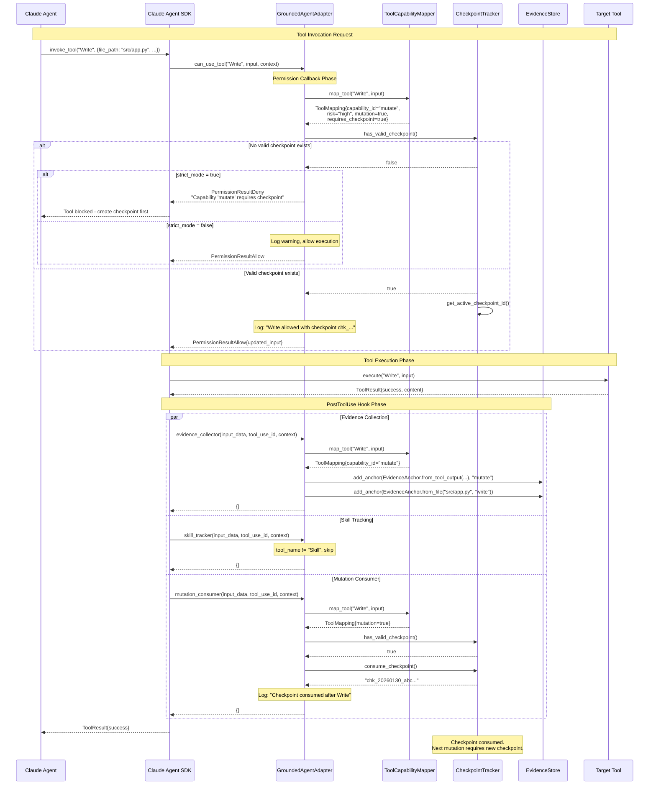
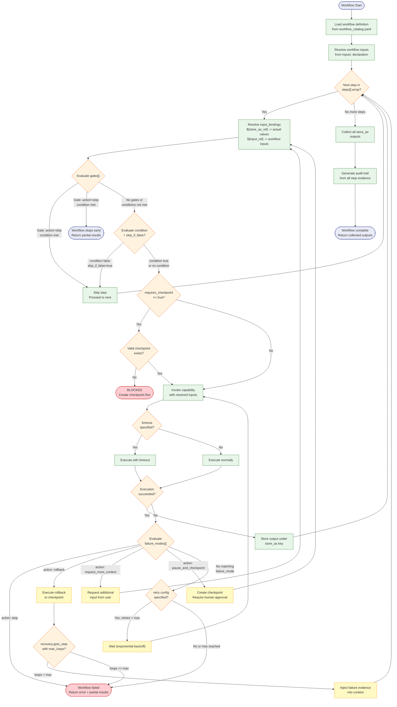
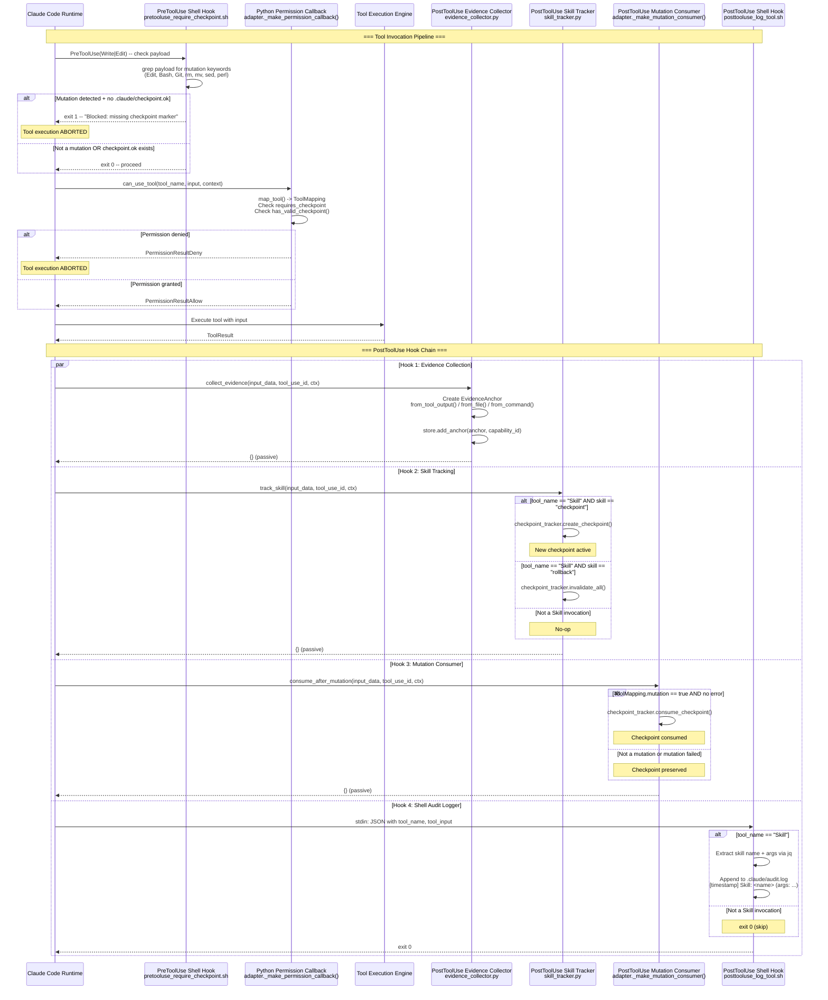
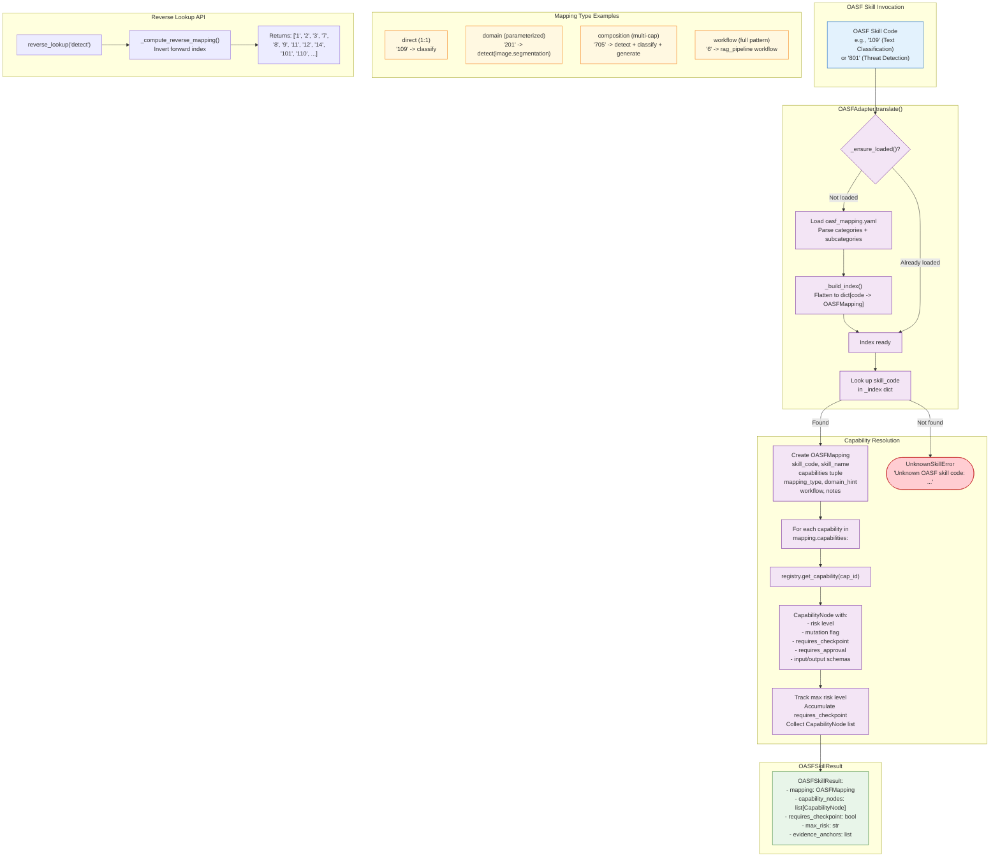
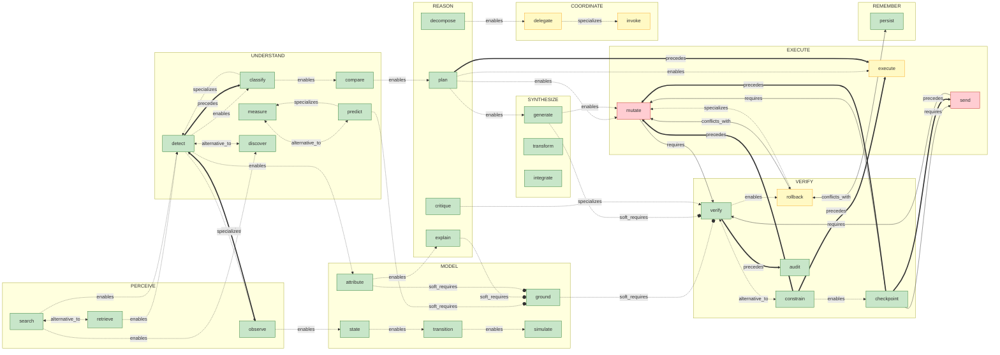

# System Diagrams and Feature Inventory

**Document ID:** ACS-ANALYSIS-02
**Version:** 1.0.0
**Date:** 2026-01-30
**Scope:** Agent Capability Standard -- Architectural diagrams, data flows, and exhaustive feature catalog

---

## Table of Contents

1. [Overview](#1-overview)
2. [Diagram 1: High-Level Plugin Architecture](#2-diagram-1-high-level-plugin-architecture)
3. [Diagram 2: Cognitive Layer Diagram](#3-diagram-2-cognitive-layer-diagram)
4. [Diagram 3: SDK Class Diagram](#4-diagram-3-sdk-class-diagram)
5. [Diagram 4: Safety Enforcement Sequence](#5-diagram-4-safety-enforcement-sequence)
6. [Diagram 5: Workflow Execution Flow](#6-diagram-5-workflow-execution-flow)
7. [Diagram 6: Hook Processing Pipeline](#7-diagram-6-hook-processing-pipeline)
8. [Diagram 7: OASF Translation Flow](#8-diagram-7-oasf-translation-flow)
9. [Diagram 8: Capability Edge Graph](#9-diagram-8-capability-edge-graph)
10. [Complete Feature Inventory](#10-complete-feature-inventory)
11. [Feature Status Matrix](#11-feature-status-matrix)

---

## 1. Overview

The Agent Capability Standard (ACS) is a Claude Code plugin that defines a formal capability ontology for AI agents. It comprises 36 atomic capabilities organized across 9 cognitive layers, with 12 composed workflow patterns, 7 domain profiles, a Python SDK for Claude Agent SDK integration, shell hooks for safety enforcement, 5 validation tools, and an OASF interoperability adapter.

This document provides eight Mermaid diagrams capturing the system architecture at different levels of abstraction, followed by an exhaustive feature inventory organized by subsystem and a status matrix tracking implementation progress.

---

## 2. Diagram 1: High-Level Plugin Architecture

This diagram shows the six major subsystems and their data flow relationships. The Schemas subsystem acts as the single source of truth, consumed by all other subsystems.

```mermaid
flowchart TB
    subgraph Schemas["SCHEMAS (Source of Truth)"]
        direction TB
        ONT["capability_ontology.yaml\n36 capabilities, 9 layers\n7 edge types, 80+ edges"]
        WFC["workflow_catalog.yaml\n12 workflow patterns"]
        PRF["profiles/*.yaml\n7 domain profiles"]
        WSS["world_state_schema.yaml\nevent_schema.yaml"]
        TRF["transforms/*.yaml\n6 coercion mappings"]
        PRS["profile_schema.yaml"]
    end

    subgraph SDK["SDK (grounded_agency/)"]
        direction TB
        ADP["GroundedAgentAdapter\n+ GroundedAgentConfig"]
        REG["CapabilityRegistry\nOntology loader + query API"]
        MAP["ToolCapabilityMapper\nTool -> Capability resolution"]
        CPT["CheckpointTracker\nLifecycle management"]
        EVS["EvidenceStore\nProvenance anchors"]
        OASF["OASFAdapter\nInterop translation"]
    end

    subgraph Hooks["HOOKS (Safety Enforcement)"]
        direction TB
        HCF["hooks.json\nHook configuration"]
        PRE["pretooluse_require_checkpoint.sh\nMutation gate"]
        POST["posttooluse_log_tool.sh\nAudit logger"]
        PYEC["evidence_collector.py\nPostToolUse evidence hook"]
        PYST["skill_tracker.py\nPostToolUse checkpoint hook"]
    end

    subgraph Skills["SKILLS (41 skill files)"]
        direction TB
        S36["36 atomic capability skills\nskills/<name>/SKILL.md"]
        SMETA["5 composed/meta skills\ndebug-workflow, digital-twin-*\ncapability-gap-analysis\nperspective-validation"]
        SSCH["Generated output schemas\nskills/<name>/schemas/"]
        SREF["Bundled references\nskills/<name>/reference/"]
    end

    subgraph Validators["VALIDATORS (tools/)"]
        direction TB
        VW["validate_workflows.py\nSchema + type + consumer checking"]
        VP["validate_profiles.py\nProfile schema conformance"]
        VO["validate_ontology.py\nGraph: orphans, cycles, symmetry"]
        VR["validate_skill_refs.py\nPhantom path detection"]
        SS["sync_skill_schemas.py\nOntology -> skill schema sync"]
    end

    subgraph Interop["INTEROP (schemas/interop/)"]
        direction TB
        OMP["oasf_mapping.yaml\n15 OASF categories\n60+ subcategories"]
        RVM["Reverse mapping\n36 capabilities -> OASF codes"]
        SEP["OASF Safety Extensions\nProposal document"]
    end

    %% Data flows
    ONT -->|"loads"| REG
    ONT -->|"validates against"| VW
    ONT -->|"validates against"| VO
    ONT -->|"generates schemas"| SS
    SS -->|"writes to"| SSCH

    WFC -->|"validates against"| VW
    PRF -->|"validates against"| VP
    PRS -->|"schema for"| VP

    REG -->|"provides capabilities"| MAP
    REG -->|"provides capabilities"| OASF

    ADP -->|"creates"| CPT
    ADP -->|"creates"| EVS
    ADP -->|"injects hooks"| Hooks
    MAP -->|"risk + checkpoint data"| ADP

    OMP -->|"loads"| OASF
    OASF -->|"resolves to"| REG

    HCF -->|"configures"| PRE
    HCF -->|"configures"| POST

    S36 -->|"references"| ONT
    SMETA -->|"composes"| WFC

    VR -->|"validates"| S36
    VR -->|"validates"| SREF

    classDef schemaBox fill:#e1f5fe,stroke:#01579b,color:#01579b
    classDef sdkBox fill:#f3e5f5,stroke:#4a148c,color:#4a148c
    classDef hookBox fill:#fff3e0,stroke:#e65100,color:#e65100
    classDef skillBox fill:#e8f5e9,stroke:#1b5e20,color:#1b5e20
    classDef validBox fill:#fce4ec,stroke:#880e4f,color:#880e4f
    classDef interopBox fill:#f1f8e9,stroke:#33691e,color:#33691e

    class ONT,WFC,PRF,WSS,TRF,PRS schemaBox
    class ADP,REG,MAP,CPT,EVS,OASF sdkBox
    class HCF,PRE,POST,PYEC,PYST hookBox
    class S36,SMETA,SSCH,SREF skillBox
    class VW,VP,VO,VR,SS validBox
    class OMP,RVM,SEP interopBox
```

### Architecture Notes

- **Schemas** are the canonical source of truth. Every other subsystem derives its behavior from YAML definitions.
- **SDK** provides programmatic access to the ontology and safety enforcement at runtime.
- **Hooks** enforce safety at the Claude Code plugin level (shell) and at the SDK level (Python async callbacks).
- **Skills** are Markdown-based implementations that follow the ontology contracts.
- **Validators** run as offline CI checks to catch structural inconsistencies.
- **Interop** bridges the Agent Capability Standard to the OASF ecosystem.

---

## 3. Diagram 2: Cognitive Layer Diagram

The 36 atomic capabilities are organized into 9 cognitive layers. Information flows predominantly downward from perception through execution, with feedback loops from VERIFY back to earlier layers and persistent storage in REMEMBER. COORDINATE operates laterally across agents.

```mermaid
flowchart TB
    subgraph PERCEIVE["PERCEIVE -- Information Acquisition (4)"]
        direction LR
        retrieve["retrieve\nGet data by ref"]
        search["search\nQuery by criteria"]
        observe["observe\nWatch current state"]
        receive["receive\nAccept pushed data"]
    end

    subgraph UNDERSTAND["UNDERSTAND -- Making Sense of Information (6)"]
        direction LR
        detect["detect\nFind patterns"]
        classify["classify\nAssign labels"]
        measure["measure\nQuantify values"]
        predict["predict\nForecast outcomes"]
        compare["compare\nEvaluate options"]
        discover["discover\nFind unknowns"]
    end

    subgraph REASON["REASON -- Planning and Analysis (4)"]
        direction LR
        plan["plan\nCreate action sequence"]
        decompose["decompose\nBreak into parts"]
        critique["critique\nIdentify weaknesses"]
        explain["explain\nJustify conclusions"]
    end

    subgraph MODEL["MODEL -- World Representation (5)"]
        direction LR
        state["state\nCurrent world state"]
        transition["transition\nState changes"]
        attribute["attribute\nCause-effect"]
        ground["ground\nAnchor to evidence"]
        simulate["simulate\nWhat-if scenarios"]
    end

    subgraph SYNTHESIZE["SYNTHESIZE -- Content Creation (3)"]
        direction LR
        generate["generate\nProduce content"]
        transform["transform\nConvert formats"]
        integrate["integrate\nMerge sources"]
    end

    subgraph EXECUTE["EXECUTE -- Changing the World (3)"]
        direction LR
        execute["execute\nRun code"]
        mutate["mutate\nChange state"]
        send["send\nTransmit data"]
    end

    subgraph VERIFY["VERIFY -- Correctness Assurance (5)"]
        direction LR
        verify["verify\nCheck conditions"]
        checkpoint["checkpoint\nSave for recovery"]
        rollback["rollback\nRestore state"]
        constrain["constrain\nEnforce limits"]
        audit["audit\nRecord events"]
    end

    subgraph REMEMBER["REMEMBER -- State Persistence (2)"]
        direction LR
        persist["persist\nStore durably"]
        recall["recall\nRetrieve stored"]
    end

    subgraph COORDINATE["COORDINATE -- Multi-Agent Interaction (4)"]
        direction LR
        delegate["delegate\nAssign to agent"]
        synchronize["synchronize\nAchieve agreement"]
        invoke["invoke\nExecute workflow"]
        inquire["inquire\nRequest clarification"]
    end

    %% Primary information flow (top-down)
    PERCEIVE -->|"raw data"| UNDERSTAND
    UNDERSTAND -->|"interpreted data"| REASON
    REASON -->|"plans, analysis"| MODEL
    MODEL -->|"world model"| SYNTHESIZE
    SYNTHESIZE -->|"artifacts"| EXECUTE
    EXECUTE -->|"outcomes"| VERIFY

    %% Feedback loops
    VERIFY -->|"rollback / retry"| REASON
    VERIFY -->|"audit trail"| REMEMBER
    REMEMBER -->|"historical context"| PERCEIVE

    %% Lateral coordination
    COORDINATE ---|"delegates across agents"| EXECUTE
    COORDINATE ---|"synchronizes state"| MODEL

    classDef lowRisk fill:#c8e6c9,stroke:#2e7d32,color:#1b5e20
    classDef medRisk fill:#fff9c4,stroke:#f9a825,color:#e65100
    classDef highRisk fill:#ffcdd2,stroke:#c62828,color:#b71c1c

    class retrieve,search,observe,receive lowRisk
    class detect,classify,measure,predict,compare,discover lowRisk
    class plan,decompose,critique,explain lowRisk
    class state,transition,attribute,ground,simulate lowRisk
    class generate,transform,integrate lowRisk
    class execute medRisk
    class mutate,send highRisk
    class verify,constrain lowRisk
    class checkpoint,audit lowRisk
    class rollback medRisk
    class persist,recall lowRisk
    class delegate,synchronize,invoke medRisk
    class inquire lowRisk
```

### Layer Risk Distribution

| Risk Level | Count | Capabilities |
|------------|-------|-------------|
| Low        | 28    | All PERCEIVE, UNDERSTAND, REASON, MODEL, SYNTHESIZE, plus verify, checkpoint, constrain, audit, persist, recall, inquire |
| Medium     | 5     | execute, rollback, delegate, synchronize, invoke |
| High       | 3     | mutate, send (plus checkpoint/audit have mutation=true) |

---

## 4. Diagram 3: SDK Class Diagram

The Python SDK in `grounded_agency/` provides programmatic integration with the Claude Agent SDK. The following class diagram shows all public classes, their key attributes, methods, and relationships.

```mermaid
classDiagram
    class GroundedAgentConfig {
        +str ontology_path
        +bool strict_mode
        +str audit_log_path
        +str checkpoint_dir
        +int expiry_minutes
    }

    class GroundedAgentAdapter {
        +GroundedAgentConfig config
        +CapabilityRegistry registry
        +ToolCapabilityMapper mapper
        +CheckpointTracker checkpoint_tracker
        +EvidenceStore evidence_store
        +wrap_options(base: Any) Any
        +create_checkpoint(scope, reason) str
        +consume_checkpoint() str|None
        +has_valid_checkpoint() bool
        +get_evidence(n: int) list~str~
        +get_mutations() list~EvidenceAnchor~
        +ontology_version: str
        +capability_count: int
        -_make_permission_callback() Callable
        -_make_mutation_consumer() Callable
        -_wrap_hook(hook_fn, matcher) Any
    }

    class CapabilityRegistry {
        -Path _ontology_path
        -dict _ontology
        -dict~str,CapabilityNode~ _nodes_by_id
        -list~CapabilityEdge~ _edges
        -dict _outgoing_edges
        -dict _incoming_edges
        +ontology: dict
        +version: str
        +capability_count: int
        +get_capability(cap_id) CapabilityNode|None
        +get_edges(cap_id) list~CapabilityEdge~
        +get_outgoing_edges(cap_id) list~CapabilityEdge~
        +get_incoming_edges(cap_id) list~CapabilityEdge~
        +get_required_capabilities(cap_id) list~str~
        +get_preceding_capabilities(cap_id) list~str~
        +get_conflicting_capabilities(cap_id) list~str~
        +get_alternatives(cap_id) list~str~
        +get_specialized_by(cap_id) list~str~
        +get_generalizes_to(cap_id) str|None
        +get_layer(layer_name) dict
        +get_capabilities_in_layer(layer_name) list~CapabilityNode~
        +get_high_risk_capabilities() list~CapabilityNode~
        +get_checkpoint_required_capabilities() list~CapabilityNode~
        +all_capabilities() list~CapabilityNode~
    }

    class CapabilityNode {
        +str id
        +str layer
        +str description
        +str risk
        +bool mutation
        +bool requires_checkpoint
        +bool requires_approval
        +dict input_schema
        +dict output_schema
        +from_dict(data) CapabilityNode$
    }

    class CapabilityEdge {
        +str from_cap
        +str to_cap
        +str edge_type
    }

    class ToolCapabilityMapper {
        -dict _ontology
        +map_tool(tool_name, tool_input) ToolMapping
        +is_high_risk(tool_name, tool_input) bool
        +requires_checkpoint(tool_name, tool_input) bool
        +is_mutation(tool_name, tool_input) bool
        +get_capability_id(tool_name, tool_input) str
        -_classify_bash_command(tool_input) ToolMapping
    }

    class ToolMapping {
        +str capability_id
        +str risk
        +bool mutation
        +bool requires_checkpoint
        +__str__() str
    }

    class CheckpointTracker {
        -Path _checkpoint_dir
        -int _max_history
        -Checkpoint _active_checkpoint
        -list~Checkpoint~ _checkpoint_history
        +create_checkpoint(scope, reason, expiry_minutes, metadata) str
        +has_valid_checkpoint() bool
        +has_checkpoint_for_scope(target) bool
        +get_active_checkpoint() Checkpoint|None
        +get_active_checkpoint_id() str|None
        +consume_checkpoint() str|None
        +get_checkpoint_by_id(checkpoint_id) Checkpoint|None
        +get_history(limit) list~Checkpoint~
        +clear_expired() int
        +invalidate_all() void
        +checkpoint_count: int
    }

    class Checkpoint {
        +str id
        +list~str~ scope
        +str reason
        +datetime created_at
        +datetime|None expires_at
        +bool consumed
        +datetime|None consumed_at
        +dict metadata
        +is_valid() bool
        +matches_scope(target) bool
    }

    class EvidenceStore {
        -int _max_anchors
        -deque~EvidenceAnchor~ _anchors
        -dict _by_kind
        -dict _by_capability
        +add_anchor(anchor, capability_id) void
        +get_recent(n) list~str~
        +get_recent_anchors(n) list~EvidenceAnchor~
        +get_by_kind(kind) list~EvidenceAnchor~
        +get_for_capability(capability_id) list~EvidenceAnchor~
        +get_for_capability_output(capability_id) list~str~
        +get_mutations() list~EvidenceAnchor~
        +get_tool_outputs() list~EvidenceAnchor~
        +search_by_ref_prefix(prefix) list~EvidenceAnchor~
        +search_by_metadata(key, value) list~EvidenceAnchor~
        +clear() void
        +to_list() list~dict~
    }

    class EvidenceAnchor {
        +str ref
        +str kind
        +str timestamp
        +dict metadata
        +from_tool_output(tool_name, tool_use_id, tool_input, tool_response) EvidenceAnchor$
        +from_file(file_path, file_hash, operation) EvidenceAnchor$
        +from_command(command, exit_code, tool_use_id) EvidenceAnchor$
        +from_mutation(target, operation, checkpoint_id) EvidenceAnchor$
    }

    class OASFAdapter {
        -Path _mapping_path
        -dict _raw
        -dict~str,OASFMapping~ _index
        -CapabilityRegistry _registry
        -dict _computed_reverse
        +translate(skill_code) OASFSkillResult
        +get_mapping(skill_code) OASFMapping|None
        +list_categories() list~OASFMapping~
        +list_all_mappings() list~OASFMapping~
        +reverse_lookup(capability_id) list~str~
        +oasf_version: str
        +mapping_version: str
        +category_count: int
        +total_mapping_count: int
    }

    class OASFMapping {
        +str skill_code
        +str skill_name
        +tuple~str~ capabilities
        +str mapping_type
        +str|None domain_hint
        +str|None workflow
        +str|None notes
    }

    class OASFSkillResult {
        +OASFMapping mapping
        +list~CapabilityNode~ capability_nodes
        +bool requires_checkpoint
        +str max_risk
        +list~dict~ evidence_anchors
    }

    GroundedAgentAdapter --> GroundedAgentConfig : configures
    GroundedAgentAdapter --> CapabilityRegistry : uses
    GroundedAgentAdapter --> ToolCapabilityMapper : uses
    GroundedAgentAdapter --> CheckpointTracker : uses
    GroundedAgentAdapter --> EvidenceStore : uses
    CapabilityRegistry --> CapabilityNode : creates
    CapabilityRegistry --> CapabilityEdge : creates
    ToolCapabilityMapper --> ToolMapping : returns
    CheckpointTracker --> Checkpoint : manages
    EvidenceStore --> EvidenceAnchor : stores
    OASFAdapter --> CapabilityRegistry : queries
    OASFAdapter --> OASFMapping : indexes
    OASFAdapter --> OASFSkillResult : returns
    OASFSkillResult --> CapabilityNode : contains
    OASFSkillResult --> OASFMapping : references
```

### Key Design Decisions

- **Lazy loading**: Both `CapabilityRegistry` and `OASFAdapter` use lazy loading (`_ensure_loaded()`) to defer YAML parsing until first access.
- **Deque-based eviction**: `EvidenceStore` uses `collections.deque(maxlen=N)` for O(1) FIFO eviction when the anchor limit is reached.
- **SHA-256 checkpoint IDs**: `CheckpointTracker` generates 128-bit entropy IDs using `os.urandom(16)` hashed through SHA-256 to prevent ID prediction.
- **Fail-safe defaults**: `ToolCapabilityMapper` treats unknown Bash commands as high-risk mutations requiring checkpoint, implementing a secure allowlist approach.
- **Frozen dataclasses**: `OASFMapping` and `OASFSkillResult` use `@dataclass(frozen=True)` for immutability after construction.

---

## 5. Diagram 4: Safety Enforcement Sequence

This sequence diagram shows the complete safety enforcement lifecycle when a tool is invoked through the SDK, from permission check to evidence collection and checkpoint consumption.

### Safety Invariants Enforced

1. **Checkpoint-before-mutation**: High-risk tools (Write, Edit, Bash mutations) are blocked unless a valid checkpoint exists.
2. **One-checkpoint-per-mutation**: After a successful mutation, the checkpoint is consumed, requiring a fresh checkpoint for the next mutation.
3. **Fail-closed on errors**: If the permission check fails internally, access is denied (secure default).
4. **Non-blocking evidence collection**: Evidence hooks never block tool execution; they fail silently if evidence capture fails.

---

## 6. Diagram 5: Workflow Execution Flow

Workflows in `workflow_catalog.yaml` define multi-step capability compositions. This diagram shows the execution model: step binding resolution, gate evaluation, store_as output management, failure modes, and recovery loops.

### Workflow Extension Points

The workflow catalog supports five extension mechanisms (defined in `workflow_extensions`):

| Extension | Description | Example |
|-----------|-------------|---------|
| `input_bindings` | Reference outputs of prior steps via `${store_as.field}` | `${search_out.results}` |
| `conditions` | Conditional step execution with `skip_if_false` | `${world_state_out} == null` |
| `parallel_groups` | Co-schedule steps in the same `parallel_group` | `context_gathering` group |
| `recovery_loops` | Jump back to earlier step with `goto_step` and `max_loops` | Retry from `plan` on verify failure |
| `gates` | Pre-step guards that skip or stop based on conditions | Skip rollback if verify passed |

---

## 7. Diagram 6: Hook Processing Pipeline

The ACS employs two layers of hooks: shell-level hooks configured in `hooks.json` for the Claude Code plugin, and Python-level hooks injected by the `GroundedAgentAdapter` for SDK integration.

### Hook Configuration Summary

| Hook Point | Type | File | Matcher | Purpose |
|------------|------|------|---------|---------|
| PreToolUse | Shell | `pretooluse_require_checkpoint.sh` | `Write\|Edit` | Block mutations without `.claude/checkpoint.ok` |
| PostToolUse | Shell | `posttooluse_log_tool.sh` | `Skill` | Append skill invocations to `.claude/audit.log` |
| PostToolUse | Python | `evidence_collector.py` | All tools | Capture evidence anchors to `EvidenceStore` |
| PostToolUse | Python | `skill_tracker.py` | `Skill` | Update `CheckpointTracker` on checkpoint/rollback skills |
| PreToolUse | Python | `adapter._make_permission_callback()` | All tools | SDK-level checkpoint enforcement |
| PostToolUse | Python | `adapter._make_mutation_consumer()` | All tools | Consume checkpoint after successful mutation |

---

## 8. Diagram 7: OASF Translation Flow

The `OASFAdapter` translates OASF (Open Agentic Schema Framework) skill codes into Grounded Agency capabilities, enriching them with safety metadata from the capability registry.

### OASF Coverage Summary

| Metric | Value |
|--------|-------|
| OASF Categories Mapped | 15 top-level categories (1-15) |
| OASF Subcategories Mapped | 50+ subcategories |
| Mapping Types | 4 (direct, domain, composition, workflow) |
| Capabilities with No OASF Equivalent | 6 (attribute, integrate, recall, receive, send, transition) |
| Capabilities with Partial OASF Mapping | 7 (checkpoint, simulate, inquire, synchronize, state, ground, rollback) |
| Workflows Referenced by OASF | 4 (rag_pipeline, security_assessment, data_quality_pipeline, multi_agent_orchestration) |
| OASF Version Supported | 0.8.0 |

---

## 9. Diagram 8: Capability Edge Graph

The ontology defines 80+ edges between capabilities using 7 edge types. This diagram shows a representative subset demonstrating all edge types and their semantics.

### Edge Type Summary

| Edge Type | Count | Semantics | Transitive | Symmetric |
|-----------|-------|-----------|------------|-----------|
| `requires` | 4 | Hard dependency: MUST be satisfied before target executes | No | No |
| `soft_requires` | 12 | Recommended but not mandatory | No | No |
| `enables` | 30+ | Unlocks or makes possible the target capability | No | No |
| `precedes` | 15+ | Temporal ordering: must complete before target begins | Yes | No |
| `conflicts_with` | 4 (8 directed) | Mutual exclusivity: cannot coexist in same workflow | No | Yes |
| `alternative_to` | 7 (14 directed) | Substitutability: can replace each other | No | Yes |
| `specializes` | 6 | Inheritance: more specific variant of general capability | Yes | No |

---

## 10. Complete Feature Inventory

### 10.1 Schema Subsystem

| # | Feature | Description | Location |
|---|---------|-------------|----------|
| S-01 | Capability Ontology | 36 atomic capabilities with typed I/O schemas, risk levels, and mutation flags | `schemas/capability_ontology.yaml` |
| S-02 | Cognitive Layer Organization | 9 layers (PERCEIVE through COORDINATE) with cognitive mapping annotations | `schemas/capability_ontology.yaml` (layers section) |
| S-03 | Edge Type System | 7 edge types (requires, soft_requires, enables, precedes, conflicts_with, alternative_to, specializes) with formal semantics | `schemas/capability_ontology.yaml` (edge_types section) |
| S-04 | Capability Edge Graph | 80+ directed edges between capabilities encoding dependencies, ordering, conflicts, and substitutability | `schemas/capability_ontology.yaml` (edges section) |
| S-05 | Input Schema Contracts | Typed input schemas per capability with required fields, types, and descriptions | `schemas/capability_ontology.yaml` (nodes.input_schema) |
| S-06 | Output Schema Contracts | Typed output schemas requiring evidence_anchors and confidence on all capabilities | `schemas/capability_ontology.yaml` (nodes.output_schema) |
| S-07 | Workflow Catalog | 12 composed workflow patterns with step definitions, gates, failure modes, and recovery | `schemas/workflow_catalog.yaml` |
| S-08 | Monitor and Replan Workflow | Detect world changes and trigger replanning when plan assumptions are violated | `schemas/workflow_catalog.yaml` (monitor_and_replan) |
| S-09 | Clarify Intent Workflow | Resolve ambiguous user requests through targeted clarification questions | `schemas/workflow_catalog.yaml` (clarify_intent) |
| S-10 | Debug Code Change Workflow | Safely diagnose and fix bugs with checkpoint, verify, rollback cycle | `schemas/workflow_catalog.yaml` (debug_code_change) |
| S-11 | World Model Build Workflow | Construct structured world model with dynamics and uncertainty | `schemas/workflow_catalog.yaml` (world_model_build) |
| S-12 | Capability Gap Analysis Workflow | Assess project to identify missing capabilities and propose new skills | `schemas/workflow_catalog.yaml` (capability_gap_analysis) |
| S-13 | Digital Twin Sync Loop Workflow | Synchronize digital twin with incoming signals, detect drift, execute safe actions | `schemas/workflow_catalog.yaml` (digital_twin_sync_loop) |
| S-14 | Digital Twin Bootstrap Workflow | Initialize digital twin and run first sync loop using nested invoke | `schemas/workflow_catalog.yaml` (digital_twin_bootstrap) |
| S-15 | RAG Pipeline Workflow | Retrieve information and generate grounded, evidence-cited response | `schemas/workflow_catalog.yaml` (rag_pipeline) |
| S-16 | Security Assessment Workflow | Identify and assess security vulnerabilities with risk scoring and mitigation | `schemas/workflow_catalog.yaml` (security_assessment) |
| S-17 | Multi-Agent Orchestration Workflow | Coordinate multiple agents through decomposition, delegation, and result integration | `schemas/workflow_catalog.yaml` (multi_agent_orchestration) |
| S-18 | Data Quality Pipeline Workflow | Detect, classify, measure, clean, verify, and audit data quality issues | `schemas/workflow_catalog.yaml` (data_quality_pipeline) |
| S-19 | Model Deployment Workflow | Safely deploy ML model with validation, policy checks, and rollback capability | `schemas/workflow_catalog.yaml` (model_deployment) |
| S-20 | Domain Profiles | 7 domain-specific configurations with trust weights, risk thresholds, and policies | `schemas/profiles/*.yaml` |
| S-21 | Healthcare Profile | Domain profile for healthcare with high evidence requirements | `schemas/profiles/healthcare.yaml` |
| S-22 | Manufacturing Profile | Domain profile for manufacturing/industrial processes | `schemas/profiles/manufacturing.yaml` |
| S-23 | Data Analysis Profile | Domain profile for data analysis workflows | `schemas/profiles/data_analysis.yaml` |
| S-24 | Personal Assistant Profile | Domain profile for consumer personal assistant use cases | `schemas/profiles/personal_assistant.yaml` |
| S-25 | Vision Profile | Domain profile for computer vision modality | `schemas/profiles/vision.yaml` |
| S-26 | Audio Profile | Domain profile for audio processing modality | `schemas/profiles/audio.yaml` |
| S-27 | Multimodal Profile | Domain profile for cross-modal processing | `schemas/profiles/multimodal.yaml` |
| S-28 | Profile Schema | JSON Schema defining structure for all domain profiles | `schemas/profiles/profile_schema.yaml` |
| S-29 | World State Schema | Schema for world state representation used by digital twin workflows | `schemas/world_state_schema.yaml` |
| S-30 | Event Schema | Schema for canonical events in digital twin sync loop | `schemas/event_schema.yaml` |
| S-31 | Entity Taxonomy | Taxonomy schema for entity classification | `schemas/entity_taxonomy.yaml` |
| S-32 | Identity Resolution Policy | Policy schema for entity identity resolution | `schemas/identity_resolution_policy.yaml` |
| S-33 | Authority Trust Model | Trust model schema for source authority ranking | `schemas/authority_trust_model.yaml` |
| S-34 | Transform Coercion Registry | Registry of format coercion rules for workflow data flow | `schemas/transforms/transform_coercion_registry.yaml` |
| S-35 | Transform Mappings (6) | Individual transform mapping files for data coercion | `schemas/transforms/transform_mapping_*.yaml` |
| S-36 | Workflow Data Flow Pattern | `step_outputs_are_addressable` pattern with `${store_as}` references | Workflow catalog `data_flow` sections |
| S-37 | Risk Propagation Model | `max_step_risk` strategy for computing workflow risk from step risks | Workflow catalog `risk_propagation` sections |
| S-38 | Step Gates | Pre-step condition guards with skip/stop actions | Workflow catalog `gates` arrays |
| S-39 | Failure Modes | Per-step failure handling with stop, rollback, request_more_context, pause_and_checkpoint | Workflow catalog `failure_modes` arrays |
| S-40 | Recovery Loops | Looping back to earlier step with injected failure context and max_loops guard | Workflow catalog `recovery` objects |
| S-41 | Domain-Specific Workflows (4) | Separate workflow files for healthcare, manufacturing, data analysis, personal assistant | `schemas/workflows/*.yaml` |

### 10.2 SDK Subsystem

| # | Feature | Description | Location |
|---|---------|-------------|----------|
| K-01 | GroundedAgentAdapter | Main entry point wrapping SDK options with safety layer | `grounded_agency/adapter.py` |
| K-02 | GroundedAgentConfig | Configuration dataclass with ontology_path, strict_mode, audit settings | `grounded_agency/adapter.py` |
| K-03 | Auto-discovery of ontology path | Searches package-relative, project-relative, and cwd-relative paths | `grounded_agency/adapter.py` (`_find_ontology_path`) |
| K-04 | CapabilityRegistry | Lazy-loading YAML parser with indexed capability and edge lookups | `grounded_agency/capabilities/registry.py` |
| K-05 | CapabilityNode dataclass | Typed representation of ontology capability with risk, mutation, approval flags | `grounded_agency/capabilities/registry.py` |
| K-06 | CapabilityEdge dataclass | Typed representation of edge between capabilities | `grounded_agency/capabilities/registry.py` |
| K-07 | Edge query API | `get_required_capabilities()`, `get_preceding_capabilities()`, `get_conflicting_capabilities()`, `get_alternatives()`, `get_specialized_by()`, `get_generalizes_to()` | `grounded_agency/capabilities/registry.py` |
| K-08 | Layer query API | `get_layer()`, `get_capabilities_in_layer()` | `grounded_agency/capabilities/registry.py` |
| K-09 | Risk query API | `get_high_risk_capabilities()`, `get_checkpoint_required_capabilities()` | `grounded_agency/capabilities/registry.py` |
| K-10 | O(1) edge index | `_outgoing_edges` and `_incoming_edges` dicts for constant-time edge lookups | `grounded_agency/capabilities/registry.py` |
| K-11 | ToolCapabilityMapper | Maps SDK tool names to capability metadata (ToolMapping) | `grounded_agency/capabilities/mapper.py` |
| K-12 | ToolMapping dataclass | capability_id, risk, mutation, requires_checkpoint for each tool | `grounded_agency/capabilities/mapper.py` |
| K-13 | Static tool mappings | Pre-defined mappings for Read, Glob, Grep, LS, WebFetch, WebSearch, Write, Edit, MultiEdit, NotebookEdit, Task, Skill, AskUser, TodoRead, TodoWrite | `grounded_agency/capabilities/mapper.py` |
| K-14 | Bash command classifier | Regex-based analysis of Bash commands: destructive patterns, network sends, shell injection, read-only allowlist | `grounded_agency/capabilities/mapper.py` |
| K-15 | Shell injection detection | Regex patterns for command substitution, backticks, eval, exec, control characters, hex/unicode escapes | `grounded_agency/capabilities/mapper.py` |
| K-16 | Fail-safe command defaults | Unknown Bash commands default to high-risk mutation requiring checkpoint | `grounded_agency/capabilities/mapper.py` |
| K-17 | CheckpointTracker | Manages checkpoint creation, validity, consumption, and history | `grounded_agency/state/checkpoint_tracker.py` |
| K-18 | Checkpoint dataclass | id, scope, reason, created_at, expires_at, consumed, consumed_at, metadata | `grounded_agency/state/checkpoint_tracker.py` |
| K-19 | Scope-based checkpoint matching | `fnmatch`-based glob pattern matching for checkpoint scope | `grounded_agency/state/checkpoint_tracker.py` |
| K-20 | Checkpoint expiry | Time-based expiration with configurable expiry_minutes (default 30) | `grounded_agency/state/checkpoint_tracker.py` |
| K-21 | SHA-256 checkpoint ID generation | 128-bit entropy IDs from `os.urandom(16)` hashed through SHA-256 | `grounded_agency/state/checkpoint_tracker.py` |
| K-22 | Checkpoint history pruning | Automatic pruning of oldest checkpoints when max_history (100) exceeded | `grounded_agency/state/checkpoint_tracker.py` |
| K-23 | EvidenceStore | Bounded in-memory store with FIFO eviction (deque-based, default 10000 max) | `grounded_agency/state/evidence_store.py` |
| K-24 | EvidenceAnchor dataclass | ref, kind, timestamp, metadata with factory methods for tool_output, file, command, mutation | `grounded_agency/state/evidence_store.py` |
| K-25 | Evidence metadata sanitization | Key validation (alphanumeric+underscore), depth limiting (max 2), size limiting (1KB), truncation on overflow | `grounded_agency/state/evidence_store.py` |
| K-26 | Evidence kind-based indexing | `_by_kind` dict for O(1) lookup by evidence type | `grounded_agency/state/evidence_store.py` |
| K-27 | Evidence capability indexing | `_by_capability` dict for O(1) lookup by capability ID | `grounded_agency/state/evidence_store.py` |
| K-28 | Evidence search API | `search_by_ref_prefix()`, `search_by_metadata()` for querying evidence | `grounded_agency/state/evidence_store.py` |
| K-29 | Evidence collector hook | PostToolUse async hook that captures evidence from every tool execution | `grounded_agency/hooks/evidence_collector.py` |
| K-30 | File evidence capture | Automatic file evidence anchors for Read, Write, Edit, MultiEdit operations | `grounded_agency/hooks/evidence_collector.py` |
| K-31 | Command evidence capture | Automatic command evidence anchors for Bash executions with exit code | `grounded_agency/hooks/evidence_collector.py` |
| K-32 | Skill tracker hook | PostToolUse hook detecting checkpoint/rollback skill invocations | `grounded_agency/hooks/skill_tracker.py` |
| K-33 | Autonomous checkpoint creation | When Claude invokes the checkpoint skill, the tracker automatically creates a checkpoint | `grounded_agency/hooks/skill_tracker.py` |
| K-34 | Rollback invalidation | When Claude invokes the rollback skill, all checkpoints are invalidated | `grounded_agency/hooks/skill_tracker.py` |
| K-35 | Permission callback | `can_use_tool` callback enforcing checkpoint-before-mutation with strict/non-strict modes | `grounded_agency/adapter.py` |
| K-36 | Mutation consumer hook | PostToolUse hook that auto-consumes checkpoint after successful mutation | `grounded_agency/adapter.py` |
| K-37 | SDK-agnostic integration | Uses `Any` types and try/except imports to avoid hard dependency on `claude_agent_sdk` | `grounded_agency/adapter.py` |
| K-38 | HookCallback type alias | Canonical type: `Callable[[dict, str|None, Any], Coroutine[Any, Any, dict]]` | `grounded_agency/__init__.py` |
| K-39 | OASFAdapter | Translates OASF skill codes to Grounded Agency capabilities with safety metadata | `grounded_agency/adapters/oasf.py` |
| K-40 | OASFMapping dataclass | Frozen dataclass: skill_code, skill_name, capabilities tuple, mapping_type, domain_hint, workflow, notes | `grounded_agency/adapters/oasf.py` |
| K-41 | OASFSkillResult dataclass | Translation result: mapping, capability_nodes, requires_checkpoint, max_risk, evidence_anchors | `grounded_agency/adapters/oasf.py` |
| K-42 | OASF reverse lookup | Compute reverse mapping from capabilities to OASF codes with caching | `grounded_agency/adapters/oasf.py` |
| K-43 | UnknownSkillError | Custom exception for unmapped OASF skill codes | `grounded_agency/adapters/oasf.py` |
| K-44 | OASF category listing | `list_categories()` and `list_all_mappings()` for introspection | `grounded_agency/adapters/oasf.py` |
| K-45 | Null handler logging | Package-level `NullHandler()` to let users configure their own logging | `grounded_agency/__init__.py` |

### 10.3 Hook Subsystem

| # | Feature | Description | Location |
|---|---------|-------------|----------|
| H-01 | Hook configuration file | JSON configuration mapping hook points to shell scripts | `hooks/hooks.json` |
| H-02 | PreToolUse checkpoint gate | Shell hook blocking Write/Edit without `.claude/checkpoint.ok` marker | `hooks/pretooluse_require_checkpoint.sh` |
| H-03 | PreToolUse mutation detection | Regex matching for Edit, Bash, Git, rm, mv, sed, perl patterns | `hooks/pretooluse_require_checkpoint.sh` |
| H-04 | PostToolUse audit logger | Shell hook appending Skill invocations to `.claude/audit.log` | `hooks/posttooluse_log_tool.sh` |
| H-05 | Audit log format | `[ISO-8601-timestamp] Skill: <name> (args: <args>)` format | `hooks/posttooluse_log_tool.sh` |
| H-06 | JSON stdin parsing | Reads hook input via stdin and parses with `jq` | `hooks/posttooluse_log_tool.sh` |
| H-07 | Graceful jq fallback | Silently exits if `jq` is not available | `hooks/posttooluse_log_tool.sh` |
| H-08 | Configurable log directory | Uses `CLAUDE_PROJECT_DIR` environment variable or `pwd` for log directory | `hooks/posttooluse_log_tool.sh` |

### 10.4 Skill Subsystem

| # | Feature | Description | Location |
|---|---------|-------------|----------|
| L-01 | 36 atomic capability skills | One SKILL.md per capability with YAML frontmatter, contracts, and procedures | `skills/<name>/SKILL.md` (36 files) |
| L-02 | YAML frontmatter | name, description, allowed-tools, agent type, and layer metadata | Each SKILL.md |
| L-03 | Input/output contracts | Typed I/O contracts with domain parameter for specialization | Each SKILL.md |
| L-04 | Domain parameterization | Same capability serves multiple domains via `domain:` parameter (e.g., detect with domain: anomaly, entity, vulnerability) | Each SKILL.md |
| L-05 | Procedure steps | Step-by-step procedures with evidence grounding requirements | Each SKILL.md |
| L-06 | Safety constraints | Ontology-derived risk levels, checkpoint requirements, and approval gates | Each SKILL.md |
| L-07 | Debug Workflow skill | Composed skill for debugging code changes across capability layers | `skills/debug-workflow/SKILL.md` |
| L-08 | Digital Twin Bootstrap skill | Composed skill for initializing digital twins | `skills/digital-twin-bootstrap/SKILL.md` |
| L-09 | Digital Twin Sync Loop skill | Composed skill for synchronizing digital twin state | `skills/digital-twin-sync-loop/SKILL.md` |
| L-10 | Capability Gap Analysis skill | Meta-skill for assessing capability coverage | `skills/capability-gap-analysis/SKILL.md` |
| L-11 | Perspective Validation skill | PVC (Perspective Validation Checklist) system for validating proposals | `skills/perspective-validation/SKILL.md` |
| L-12 | Generated output schemas | Auto-generated `output_schema.yaml` synced from ontology | `skills/<name>/schemas/output_schema.yaml` |
| L-13 | Bundled reference files | Self-contained reference copies of workflow_catalog, world_state_schema, event_schema | `skills/<name>/reference/*.yaml` |
| L-14 | Flat skill directory structure | All skills at `skills/<name>/` (no nesting by category) | `skills/` directory |
| L-15 | Skill template | Enhanced template for creating new capability skills | `templates/SKILL_TEMPLATE_ENHANCED.md` |
| L-16 | PVC report template | YAML template for perspective validation reports | `skills/perspective-validation/pvc_report_template.yaml` |

### 10.5 Validation Subsystem

| # | Feature | Description | Location |
|---|---------|-------------|----------|
| V-01 | Workflow validator | Schema resolution, type inference, consumer-type checking, and patch suggestions | `tools/validate_workflows.py` |
| V-02 | Structural validation | Capability existence, prerequisite satisfaction, mapping_ref/output_conforms_to resolution | `tools/validate_workflows.py` |
| V-03 | Reference validation | `${store.path}` resolution and external input reference resolution | `tools/validate_workflows.py` |
| V-04 | Type system validation | Inferred types for untyped bindings, typed annotation validation against schema | `tools/validate_workflows.py` |
| V-05 | Consumer-side type checking | Validates binding types against consumer capability's input_schema | `tools/validate_workflows.py` |
| V-06 | Patch suggestions | Machine-usable fix suggestions: insert transform step, update binding, mapping_ref from coercion registry | `tools/validate_workflows.py` |
| V-07 | Diff patch output | Optional `--emit-patch` flag generates unified diff of suggested fixes | `tools/validate_workflows.py` |
| V-08 | Profile validator | Validates domain profiles against profile_schema.yaml for field presence, trust weight ranges, enum values | `tools/validate_profiles.py` |
| V-09 | Trust weight range validation | Ensures all trust weights are between 0.0 and 1.0 | `tools/validate_profiles.py` |
| V-10 | Semantic version validation | Checks version field matches semver format | `tools/validate_profiles.py` |
| V-11 | Ontology graph validator | Detects orphan capabilities, validates edge symmetry, detects cycles in hard dependencies | `tools/validate_ontology.py` |
| V-12 | Orphan detection | Finds capabilities with no incoming or outgoing edges | `tools/validate_ontology.py` |
| V-13 | Symmetric edge validation | Verifies bidirectional edges for conflicts_with and alternative_to | `tools/validate_ontology.py` |
| V-14 | Cycle detection | Detects cycles in requires and precedes edge subgraphs | `tools/validate_ontology.py` |
| V-15 | Duplicate edge detection | Optional `--check-duplicates` flag for multiple edge types between capability pairs | `tools/validate_ontology.py` |
| V-16 | Skill reference validator | Checks that file paths in SKILL.md files resolve to existing files | `tools/validate_skill_refs.py` |
| V-17 | Phantom path detection | Catches references to files that were never created or have been removed | `tools/validate_skill_refs.py` |
| V-18 | Strict section parsing | Only validates paths in structural dependency sections (Compatible schemas, References, Located at, Workflow references) | `tools/validate_skill_refs.py` |
| V-19 | Schema synchronizer | Generates skill-local output_schema.yaml from ontology and bundles transitive dependencies | `tools/sync_skill_schemas.py` |
| V-20 | Transitive dependency bundling | Copies world_state_schema, event_schema, and transform mappings into skill reference directories | `tools/sync_skill_schemas.py` |
| V-21 | Path rewriting | Rewrites internal `schemas/` paths in bundled workflow_catalog.yaml to use skill-local paths | `tools/sync_skill_schemas.py` |
| V-22 | Dry-run mode | `--dry-run` flag previews schema sync without writing files | `tools/sync_skill_schemas.py` |
| V-23 | Conformance test runner | Script for running conformance tests locally | `scripts/run_conformance.py` |

### 10.6 Interop Subsystem

| # | Feature | Description | Location |
|---|---------|-------------|----------|
| I-01 | OASF mapping file | Bidirectional mapping between 15 OASF categories (50+ subcategories) and 36 capabilities | `schemas/interop/oasf_mapping.yaml` |
| I-02 | Direct mapping type | 1:1 correspondence between OASF skill and capability (e.g., 109 -> classify) | `schemas/interop/oasf_mapping.yaml` |
| I-03 | Domain mapping type | Same capability parameterized by domain (e.g., 201 -> detect with image.segmentation) | `schemas/interop/oasf_mapping.yaml` |
| I-04 | Composition mapping type | Multiple capabilities required (e.g., 705 -> detect + classify + generate) | `schemas/interop/oasf_mapping.yaml` |
| I-05 | Workflow mapping type | Maps to composed workflow pattern (e.g., 6 -> rag_pipeline) | `schemas/interop/oasf_mapping.yaml` |
| I-06 | Forward mapping (OASF -> GA) | 15 categories with subcategories mapped to capability lists | `schemas/interop/oasf_mapping.yaml` (categories section) |
| I-07 | Reverse mapping (GA -> OASF) | 36 capabilities mapped to lists of OASF codes | `schemas/interop/oasf_mapping.yaml` (reverse_mapping section) |
| I-08 | Gap documentation | 6 capabilities with no OASF equivalent and 7 with partial mappings documented | `schemas/interop/oasf_mapping.yaml` (comments) |
| I-09 | OASF safety extensions proposal | Proposal document for extending OASF with safety primitives | `docs/proposals/OASF_SAFETY_EXTENSIONS.md` |
| I-10 | Python OASFAdapter | Runtime translation engine with index building, capability resolution, and risk computation | `grounded_agency/adapters/oasf.py` |
| I-11 | Modality handling guide | Documentation for vision, audio, and multimodal capability handling | `docs/guides/MODALITY_HANDLING.md` |

---

## 11. Feature Status Matrix

This matrix tracks the implementation status of every major feature across all subsystems.

### Legend
- **Implemented**: Feature is fully coded, tested, and integrated
- **Partial**: Feature exists but has known gaps or missing tests
- **Planned**: Feature is designed but not yet implemented

### 11.1 Schema Features

| Feature | Status | Component | Notes |
|---------|--------|-----------|-------|
| 36 atomic capabilities with I/O schemas | Implemented | `capability_ontology.yaml` | All 36 nodes with typed input/output schemas |
| 9 cognitive layers with cognitive mapping | Implemented | `capability_ontology.yaml` | BDI, ReAct, and MCP mappings |
| 7 edge types with formal semantics | Implemented | `capability_ontology.yaml` | Documented in `spec/EDGE_TYPES.md` |
| 80+ capability edges | Implemented | `capability_ontology.yaml` | Including all symmetric pairs |
| 12 workflow patterns | Implemented | `workflow_catalog.yaml` | monitor_and_replan through model_deployment |
| Input binding system (`${store_as}`) | Implemented | `workflow_catalog.yaml` | With typed annotations (`${ref: type}`) |
| Step gates (skip/stop) | Implemented | `workflow_catalog.yaml` | Condition-based pre-step guards |
| Failure modes and recovery | Implemented | `workflow_catalog.yaml` | stop, rollback, request_more_context, pause_and_checkpoint |
| Recovery loops with goto_step | Implemented | `workflow_catalog.yaml` | With max_loops guard and context injection |
| Parallel groups | Implemented | `workflow_catalog.yaml` | `parallel_group` + `join: all_complete` |
| Risk propagation (max_step_risk) | Implemented | `workflow_catalog.yaml` | Computed risk per workflow |
| 7 domain profiles | Implemented | `schemas/profiles/` | Healthcare, manufacturing, data analysis, personal assistant, vision, audio, multimodal |
| Profile schema | Implemented | `schemas/profiles/profile_schema.yaml` | Defines required fields and enum values |
| World state schema | Implemented | `schemas/world_state_schema.yaml` | Used by digital twin workflows |
| Event schema | Implemented | `schemas/event_schema.yaml` | Canonical event format |
| Entity taxonomy | Implemented | `schemas/entity_taxonomy.yaml` | Entity classification hierarchy |
| Identity resolution policy | Implemented | `schemas/identity_resolution_policy.yaml` | Entity identity merge rules |
| Authority trust model | Implemented | `schemas/authority_trust_model.yaml` | Source authority ranking |
| Transform coercion registry | Implemented | `schemas/transforms/` | 6 coercion mapping files |
| Domain-specific workflows | Implemented | `schemas/workflows/` | 4 domain workflow files |

### 11.2 SDK Features

| Feature | Status | Component | Notes |
|---------|--------|-----------|-------|
| GroundedAgentAdapter | Implemented | `adapter.py` | Main entry point with `wrap_options()` |
| GroundedAgentConfig | Implemented | `adapter.py` | 5 configurable fields |
| Ontology auto-discovery | Implemented | `adapter.py` | Package-relative, project-relative, cwd fallback |
| CapabilityRegistry | Implemented | `registry.py` | Lazy loading, O(1) indexes |
| CapabilityNode/Edge dataclasses | Implemented | `registry.py` | Typed representations |
| Edge query API (6 methods) | Implemented | `registry.py` | required, preceding, conflicting, alternatives, specialized, generalized |
| ToolCapabilityMapper | Implemented | `mapper.py` | 15 static mappings + Bash classifier |
| Bash command classification | Implemented | `mapper.py` | 4 regex pattern sets, read-only allowlist |
| Shell injection detection | Implemented | `mapper.py` | Command substitution, backticks, eval, exec, control chars |
| CheckpointTracker | Implemented | `checkpoint_tracker.py` | Full lifecycle management |
| Checkpoint scope matching | Implemented | `checkpoint_tracker.py` | fnmatch-based glob patterns |
| Checkpoint expiry | Implemented | `checkpoint_tracker.py` | Time-based with configurable minutes |
| Checkpoint history pruning | Implemented | `checkpoint_tracker.py` | max_history=100 with oldest-first pruning |
| SHA-256 checkpoint IDs | Implemented | `checkpoint_tracker.py` | 128-bit entropy from os.urandom |
| EvidenceStore | Implemented | `evidence_store.py` | Deque-based with FIFO eviction, 10000 max |
| EvidenceAnchor | Implemented | `evidence_store.py` | 4 factory methods (tool_output, file, command, mutation) |
| Metadata sanitization | Implemented | `evidence_store.py` | Key validation, depth limiting, size limiting |
| Evidence indexes (kind, capability) | Implemented | `evidence_store.py` | O(1) lookup with eviction cleanup |
| Evidence collector hook | Implemented | `evidence_collector.py` | PostToolUse for all tools |
| File evidence capture | Implemented | `evidence_collector.py` | Read/Write/Edit/MultiEdit |
| Command evidence capture | Implemented | `evidence_collector.py` | Bash with exit code |
| Skill tracker hook | Implemented | `skill_tracker.py` | Checkpoint/rollback skill detection |
| Permission callback | Implemented | `adapter.py` | Strict/non-strict modes |
| Mutation consumer hook | Implemented | `adapter.py` | Auto-consume after success, preserve on failure |
| SDK-agnostic integration | Implemented | `adapter.py` | try/except for claude_agent_sdk imports |
| OASFAdapter | Implemented | `oasf.py` | Full translate + reverse_lookup |
| OASF flat index building | Implemented | `oasf.py` | Categories + subcategories flattened |
| OASF reverse lookup with caching | Implemented | `oasf.py` | Computed reverse mapping |
| OASFMapping/OASFSkillResult | Implemented | `oasf.py` | Frozen dataclasses |
| UnknownSkillError exception | Implemented | `oasf.py` | Custom KeyError subclass |
| Persistent checkpoint storage | Planned | `checkpoint_tracker.py` | `_checkpoint_dir` exists but no disk I/O implemented |
| SDK test suite | Implemented | `tests/test_sdk_integration.py` | Integration tests for adapter |
| Conformance test suite | Partial | `scripts/run_conformance.py` | Local-only, optional |

### 11.3 Hook Features

| Feature | Status | Component | Notes |
|---------|--------|-----------|-------|
| PreToolUse checkpoint gate (shell) | Implemented | `pretooluse_require_checkpoint.sh` | Matches Write/Edit |
| PostToolUse audit logger (shell) | Implemented | `posttooluse_log_tool.sh` | Matches Skill, logs to .claude/audit.log |
| Hook configuration file | Implemented | `hooks.json` | PreToolUse + PostToolUse arrays |
| JSON stdin parsing with jq | Implemented | `posttooluse_log_tool.sh` | Graceful fallback if jq missing |
| PostToolUse evidence collector (Python) | Implemented | `evidence_collector.py` | Injected via wrap_options |
| PostToolUse skill tracker (Python) | Implemented | `skill_tracker.py` | Injected via wrap_options |
| PostToolUse mutation consumer (Python) | Implemented | `adapter.py` | Injected via wrap_options |
| Permission callback (Python) | Implemented | `adapter.py` | Injected via wrap_options |

### 11.4 Skill Features

| Feature | Status | Component | Notes |
|---------|--------|-----------|-------|
| 36 atomic capability skills | Implemented | `skills/*/SKILL.md` | One per capability |
| 5 composed/meta skills | Implemented | `skills/*/SKILL.md` | debug-workflow, digital-twin-*, capability-gap-analysis, perspective-validation |
| YAML frontmatter | Implemented | All SKILL.md files | name, description, allowed-tools, agent, layer |
| Input/output contracts | Implemented | All SKILL.md files | Domain-parameterized |
| Generated output schemas | Implemented | `skills/*/schemas/` | Via sync_skill_schemas.py |
| Bundled references | Implemented | `skills/*/reference/` | Self-contained dependencies |
| Skill template | Implemented | `templates/SKILL_TEMPLATE_ENHANCED.md` | Enhanced template |
| PVC report template | Implemented | `skills/perspective-validation/pvc_report_template.yaml` | Perspective validation reports |

### 11.5 Validation Features

| Feature | Status | Component | Notes |
|---------|--------|-----------|-------|
| Workflow validator | Implemented | `validate_workflows.py` | 5 validation phases |
| Structural validation | Implemented | `validate_workflows.py` | Capability existence, prerequisites |
| Reference validation | Implemented | `validate_workflows.py` | ${store_as} resolution |
| Type system validation | Implemented | `validate_workflows.py` | Inferred and annotated types |
| Consumer-side type checking | Implemented | `validate_workflows.py` | Input schema conformance |
| Patch suggestions | Implemented | `validate_workflows.py` | JSON output + optional diff |
| Profile validator | Implemented | `validate_profiles.py` | Schema conformance checking |
| Trust weight range validation | Implemented | `validate_profiles.py` | 0.0-1.0 range check |
| Semantic version validation | Implemented | `validate_profiles.py` | Semver format check |
| Ontology graph validator | Implemented | `validate_ontology.py` | Orphans, cycles, symmetry |
| Orphan detection | Implemented | `validate_ontology.py` | No-edge capability detection |
| Symmetric edge validation | Implemented | `validate_ontology.py` | Bidirectional pair checking |
| Cycle detection | Implemented | `validate_ontology.py` | In requires/precedes subgraphs |
| Skill reference validator | Implemented | `validate_skill_refs.py` | Phantom path detection |
| Schema synchronizer | Implemented | `sync_skill_schemas.py` | Ontology-to-skill sync |
| Transitive dependency bundling | Implemented | `sync_skill_schemas.py` | Reference directory population |
| Path rewriting | Implemented | `sync_skill_schemas.py` | Internal path translation |
| Conformance tests | Partial | `scripts/run_conformance.py` | Local only, optional |

### 11.6 Interop Features

| Feature | Status | Component | Notes |
|---------|--------|-----------|-------|
| OASF mapping file | Implemented | `oasf_mapping.yaml` | 15 categories, 50+ subcategories |
| 4 mapping types | Implemented | `oasf_mapping.yaml` | direct, domain, composition, workflow |
| Forward mapping (OASF -> GA) | Implemented | `oasf_mapping.yaml` | Categories section |
| Reverse mapping (GA -> OASF) | Implemented | `oasf_mapping.yaml` | reverse_mapping section |
| Gap documentation | Implemented | `oasf_mapping.yaml` | 6 unmapped + 7 partial |
| Python OASFAdapter | Implemented | `oasf.py` | Full API with translate, reverse_lookup |
| OASF safety extensions proposal | Implemented | `docs/proposals/OASF_SAFETY_EXTENSIONS.md` | Design document |
| Modality handling guide | Implemented | `docs/guides/MODALITY_HANDLING.md` | Vision, audio, multimodal |
| OASF conformance tests | Implemented | `tests/test_sdk_integration.py` | Adapter integration tests |

### 11.7 Cross-Cutting Features

| Feature | Status | Component | Notes |
|---------|--------|-----------|-------|
| Domain parameterization (v2 model) | Implemented | Ontology + Skills | 36 capabilities replace 99 domain-specific variants |
| Evidence grounding | Implemented | Ontology + SDK | All capability outputs require evidence_anchors |
| Confidence scoring | Implemented | Ontology + SDK | All capability outputs require confidence [0,1] |
| Risk tiering (low/medium/high) | Implemented | Ontology + SDK + Hooks | Structural enforcement, not convention |
| Mutation flags | Implemented | Ontology + SDK | Ontology-level mutation: true/false |
| Checkpoint enforcement | Implemented | Ontology + SDK + Hooks | Multi-layer enforcement |
| Approval requirements | Implemented | Ontology | requires_approval on execute, mutate, send, delegate |
| Audit trails | Implemented | Hooks + Workflows | Shell hook + workflow audit steps |
| Plugin.json descriptor | Implemented | `.claude-plugin/plugin.json` | Claude Code plugin metadata |
| Whitepaper | Implemented | `spec/WHITEPAPER.md` | Formal specification document |
| FAQ | Implemented | `docs/FAQ.md` | Common questions and answers |
| Glossary | Implemented | `docs/GLOSSARY.md` | Term definitions |
| Grounded Agency philosophy doc | Implemented | `docs/GROUNDED_AGENCY.md` | Core philosophy |
| Tutorial | Implemented | `docs/TUTORIAL.md` | Getting started guide |
| Workflow patterns guide | Implemented | `docs/WORKFLOW_PATTERNS.md` | Pattern documentation |
| Extension governance | Implemented | `docs/methodology/EXTENSION_GOVERNANCE.md` | Process for adding capabilities |
| Skills README | Implemented | `skills/README.md` | Skills directory documentation |
| Benchmarks | Partial | `benchmarks/` | Benchmark fixtures exist, harness unclear |
| CI/CD integration | Planned | N/A | Validation tools exist but no CI config file |
| npm/PyPI publishing | Planned | `pyproject.toml` | pyproject.toml exists but not published |

---

## Appendix A: Workflow Catalog Quick Reference

| # | Workflow | Risk | Steps | Key Capabilities Used |
|---|----------|------|-------|----------------------|
| 1 | monitor_and_replan | medium | 7 | observe, state, compare, detect, critique, plan, audit |
| 2 | clarify_intent | low | 6 | critique, inquire, send, receive, integrate, audit |
| 3 | debug_code_change | medium | 11 | observe, search, attribute, constrain, critique, plan, checkpoint, execute, verify, audit, rollback |
| 4 | world_model_build | low | 13 | retrieve, observe, detect, classify, integrate, state, transition, attribute, measure, audit, ground, simulate, explain |
| 5 | capability_gap_analysis | low | 7 | observe, attribute, discover, compare (x2), generate, audit |
| 6 | digital_twin_sync_loop | high | 22 | receive, search, transform, integrate, detect (x2), classify, state, compare, transition, measure, predict, plan, constrain, checkpoint, mutate, execute, verify, audit, rollback, explain |
| 7 | digital_twin_bootstrap | high | 2 | invoke (x2, nesting world_model_build and digital_twin_sync_loop) |
| 8 | rag_pipeline | low | 7 | search, retrieve, detect, ground, generate, explain, audit |
| 9 | security_assessment | low | 7 | search, detect, measure, attribute, critique, generate, audit |
| 10 | multi_agent_orchestration | medium | 7 | decompose, plan, delegate, synchronize, verify, integrate, audit |
| 11 | data_quality_pipeline | medium | 9 | observe, detect, classify, measure, checkpoint, transform, verify, audit, rollback |
| 12 | model_deployment | high | 9 | verify (x2), constrain, checkpoint, execute, measure, audit, rollback |

## Appendix B: Domain Profile Quick Reference

| Profile | Domain | Key Trust Weights | Checkpoint Policy | Risk Threshold |
|---------|--------|-------------------|-------------------|----------------|
| Healthcare | healthcare | High evidence requirements | Always | High for mutations |
| Manufacturing | manufacturing | Sensor + system log emphasis | High risk | Medium for execution |
| Data Analysis | data_analysis | Database + document emphasis | Medium risk | Low for analysis |
| Personal Assistant | personal_assistant | Human + document emphasis | Never | Low auto-approve |
| Vision | vision | Image-specific trust weights | High risk | Medium for processing |
| Audio | audio | Audio-specific trust weights | High risk | Medium for processing |
| Multimodal | multimodal | Cross-modal trust weights | High risk | Medium for fusion |

## Appendix C: File Counts by Subsystem

| Subsystem | File Type | Count |
|-----------|-----------|-------|
| Schemas | YAML files | 20+ |
| SDK | Python modules | 8 |
| Hooks | Shell scripts | 2 |
| Hooks | JSON config | 1 |
| Skills | SKILL.md files | 41 |
| Skills | Generated schemas | 36+ |
| Skills | Bundled references | 40+ |
| Validators | Python tools | 5 |
| Interop | YAML mapping | 1 |
| Tests | Python test files | Multiple |
| Documentation | Markdown files | 15+ |

---

*Document generated from source analysis of the Agent Capability Standard repository at commit `e14a723`.*
