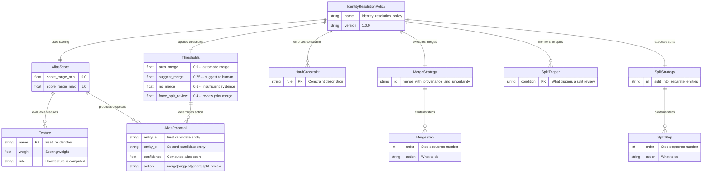

# Data Model and Entity-Relationship Diagrams

**Document:** `analysis/03-data-model-and-erd.md`
**Version:** 1.0.0
**Date:** 2026-01-30
**Scope:** Complete data model documentation for the Agent Capability Standard, including entity-relationship diagrams, SDK dataclass specifications, schema cross-references, and the I/O contract system.

---

## Table of Contents

1. [Overview](#1-overview)
2. [ERD 1: Capability Ontology Model](#2-erd-1-capability-ontology-model)
3. [ERD 2: World State Model](#3-erd-2-world-state-model)
4. [ERD 3: Entity Taxonomy Hierarchy](#4-erd-3-entity-taxonomy-hierarchy)
5. [ERD 4: Trust/Authority Model](#5-erd-4-trustauthority-model)
6. [ERD 5: Identity Resolution Model](#6-erd-5-identity-resolution-model)
7. [SDK Dataclasses](#7-sdk-dataclasses)
8. [Schema Cross-Reference Diagram](#8-schema-cross-reference-diagram)
9. [I/O Contract System Documentation](#9-io-contract-system-documentation)

---

## 1. Overview

The Agent Capability Standard defines a formal data model spanning multiple interconnected schemas. At its core is a **capability ontology** that defines 36 atomic capabilities organized across 9 cognitive layers. This ontology anchors a comprehensive world-state representation system, an entity taxonomy, trust and authority models, and an identity resolution framework. All schemas are designed to be composition-safe, meaning they can be combined and referenced across workflow boundaries while maintaining type safety and provenance.

The data model follows five foundational principles:

1. **Everything is time-indexed.** All state, observations, and claims carry timestamps.
2. **Every claim is grounded in evidence anchors.** No assertion exists without provenance.
3. **Uncertainty is explicit.** Epistemic and aleatoric uncertainty are first-class concerns.
4. **Identity is stable and aliasable.** Entity IDs are durable; aliases map to canonical IDs.
5. **State is separate from observations and from predictions.** These three domains are never conflated.

This document presents five entity-relationship diagrams, a complete SDK dataclass reference, a schema cross-reference diagram, and full documentation of the I/O contract system that binds capabilities together in workflows.

---

## 2. ERD 1: Capability Ontology Model

The capability ontology is the primary structural schema of the Agent Capability Standard. It defines the 36 atomic capabilities, their I/O contracts, risk metadata, and the graph of relationships between them.

### 2.1 Entity Descriptions

**Layer** represents one of the 9 cognitive layers in the BDI-inspired architecture. Each layer groups capabilities by cognitive function (perceive, understand, reason, model, synthesize, execute, verify, remember, coordinate). Layers carry a description and a cognitive mapping that ties them to established frameworks like BDI and control theory.

**CapabilityNode** is the fundamental unit of the ontology. Each node defines a single atomic capability with its identifier, description, risk level, mutation flag, checkpoint/approval requirements, and full input/output JSON schemas. Every capability output includes `evidence_anchors` and `confidence` fields, enforcing the grounded agency principle at the schema level.

**CapabilityEdge** represents a directed relationship between two capability nodes. The system defines 7 edge types with distinct enforcement semantics: `requires`, `soft_requires`, `enables`, `precedes`, `conflicts_with`, `alternative_to`, and `specializes`. These edges form a directed graph that validators use to check workflow correctness.

**EdgeType** is a metadata entity that defines the semantics, transitivity, and symmetry properties of each relationship type. Edge types govern how validators enforce ordering, exclusion, and substitution rules.

### 2.2 ERD Diagram


### 2.3 Layer Composition

The 9 layers and their capability allocations:

| Layer | Capabilities | Count | Cognitive Mapping |
|-------|-------------|-------|-------------------|
| PERCEIVE | retrieve, search, observe, receive | 4 | BDI: Belief acquisition |
| UNDERSTAND | detect, classify, measure, predict, compare, discover | 6 | BDI: Belief formation |
| REASON | plan, decompose, critique, explain | 4 | BDI: Deliberation |
| MODEL | state, transition, attribute, ground, simulate | 5 | BDI: World model |
| SYNTHESIZE | generate, transform, integrate | 3 | Action planning |
| EXECUTE | execute, mutate, send | 3 | BDI: Intention execution |
| VERIFY | verify, checkpoint, rollback, constrain, audit | 5 | Control theory |
| REMEMBER | persist, recall | 2 | Cognitive: Long-term memory |
| COORDINATE | delegate, synchronize, invoke, inquire | 4 | Multi-agent systems |

### 2.4 Risk and Safety Classification

The ontology encodes three risk tiers with structural enforcement:

| Risk Level | Capabilities | Properties |
|-----------|-------------|------------|
| **high** | mutate, send | `mutation: true`, `requires_checkpoint: true`, `requires_approval: true` |
| **medium** | execute, delegate, invoke, rollback | `requires_approval: true` (execute, delegate, invoke) |
| **low** | All remaining 30 capabilities | Read-only or low-risk operations |

### 2.5 Edge Type Semantics

| Edge Type | Count | Transitive | Symmetric | Enforcement |
|-----------|-------|-----------|-----------|-------------|
| `requires` | 4 | No | No | Validator MUST reject violations |
| `soft_requires` | 10 | No | No | Validator SHOULD warn |
| `enables` | 28 | No | No | Capability flow pattern |
| `precedes` | 14 | Yes | No | Temporal ordering enforced |
| `conflicts_with` | 4 pairs | No | Yes | Mutual exclusivity enforced |
| `alternative_to` | 7 pairs | No | Yes | Substitution allowed |
| `specializes` | 5 | Yes | No | Contract inheritance |

---

## 3. ERD 2: World State Model

The world state model (defined in `schemas/world_state_schema.yaml`) provides a canonical, composition-safe representation for real-world and digital-world modeling. It is designed for agent workflows with built-in support for evidence, uncertainty, provenance, and transitions.

### 3.1 Entity Descriptions

**WorldState** is the top-level container for a complete snapshot of the modeled world. It carries metadata (world_id, timestamp, version lineage), collections of entities, relationships, state variables, observations, transition rules, actions, and indexes for efficient lookups. The `version_id` and `parent_version_id` fields enable snapshot-based version control, with `lineage` providing the full ancestry chain.

**Entity** represents any identifiable object in the world, whether digital (a service, database, host) or physical (a person, location, sensor). Each entity has a stable ID following the `<class>:<namespace>/<local_id>` convention, a type drawn from the entity taxonomy, labels, aliases, attributes, status, provenance records, and optional uncertainty.

**StateVariable** captures a quantified measurement or assessment about an entity at a specific point in time. Variables carry a name, a subject (EntityRef), a Quantity value (with optional unit, scale, and uncertainty), a timestamp, a source classification (observation, inference, prediction, assumption, constraint), a validity window, provenance records, and optional tags.

**ObservationEvent** records a raw observation from the world. Observations are immutable and append-only. Each carries a unique event ID, timestamp, source description, payload object, evidence anchors, optional parsed event types, and uncertainty. Observations are the raw input that drives state updates.

**TransitionRule** defines how state changes over time. Rules specify a trigger predicate (event or schedule), guard conditions, effects (state variable updates), allowed next states, and optional rollback strategies with inverse effects. Transition rules are the dynamic component of the world model.

**ActionRecord** records an action taken by an agent or human. Actions track the actor, intent, status (planned, approved, executed, failed, rolled_back), plan reference, list of changes made, verification results, and evidence anchors. This provides a complete audit trail of all interventions.

**RelationshipEdge** connects two entities with a typed, directed relationship. Relationships carry source and destination EntityRefs, a relation type string (e.g., depends_on, owns, located_in), optional attributes, constraints, uncertainty, and provenance. The relationship graph is the structural backbone of the world model.

**Anchor** is an evidence pointer that grounds claims to verifiable sources. An anchor references a specific location (file:line, URL, tool-output-id) with a kind classification (file, url, tool, log, sensor, human_note) and optional excerpt and timestamp. Anchors are the atomic unit of provenance in the system.

**Uncertainty** captures the epistemic or aleatoric uncertainty of a measurement or claim. It specifies the uncertainty type (epistemic, aleatoric, mixed), a confidence score (0.0 to 1.0), optional confidence interval (low, high), optional distribution parameters, and optional notes. This enables principled reasoning about the reliability of information.

**ProvenanceRecord** establishes the chain of custody for a claim. It records the claim ID, creation timestamp, the agent/skill that produced it, the capability used, the evidence anchors supporting it, any transformations applied, and assumptions made. Provenance records are mandatory on entities and state variables.

**Quantity** represents a measured or computed value with its unit and scale. A Quantity wraps a value (which can be number, string, boolean, or object), an optional unit string, an optional scale classification (ordinal, nominal), and an optional Uncertainty object.

**EntityRef** is a lightweight reference to an entity, containing the entity_id, optional entity_type, and optional alias. EntityRefs are used by StateVariables, RelationshipEdges, and ObservationEvents to point to entities without embedding the full entity object.

### 3.2 ERD Diagram


### 3.3 Composition Contracts

The world state schema defines a `composition_contracts.world_state_out` section that specifies guarantees for any capability that produces a world state output:

| Guarantee | Description |
|-----------|-------------|
| Stable IDs | All entities have stable IDs and provenance |
| Time-indexed | All state variables are time-indexed and carry uncertainty |
| Uncertain relationships | All relationships carry optional uncertainty and provenance |
| Append-only observations | Observations are append-only and grounded |
| Explicit transitions | Transition rules are explicit and reversible when possible |

### 3.4 Version Lineage

The world state supports snapshot-based version control:

```
version_id: "sha256:abc123..."       <-- Current snapshot
parent_version_id: "sha256:def456..." <-- Previous snapshot
lineage:                              <-- Full ancestry
  - "sha256:ghi789..."
  - "sha256:def456..."
  - "sha256:abc123..."
```

This enables:
- **Temporal queries**: "What was the state at time T?"
- **Diff computation**: Compare any two snapshots via the `compare` capability with `domain: state_diff`
- **Rollback**: Restore a previous snapshot by pointing `parent_version_id` at the target
- **Branching**: Create alternative world state branches from any snapshot point

---

## 4. ERD 3: Entity Taxonomy Hierarchy

The entity taxonomy (defined in `schemas/entity_taxonomy.yaml`) provides a canonical classification system for all entities in the world model. It spans both digital and physical domains with 19 entity classes, each with defined subtypes and aliases.

### 4.1 Taxonomy Overview

The taxonomy divides entities into two top-level domains:

- **Digital** (10 classes): Service, Database, Host, Container, Artifact, Document, Dataset, Job, Queue, Endpoint
- **Real World** (8 classes): Person, Organization, Location, Asset, Sensor, Material, Process, Event

### 4.2 ID Convention

Entity IDs follow a structured format that encodes both class and hierarchical namespace:

```
Format: <class>:<namespace>/<local_id>

Namespace components:
  org / domain / environment / system / subsystem(optional)

Examples:
  svc:acme/payments/prod/api          -- Production API service
  db:acme/payments/prod/postgres-main -- Production PostgreSQL
  host:acme/oslo/cluster-a/node-7    -- Kubernetes node
  person:acme/hr/employee/12345      -- Employee record
  doc:acme/payments/specs/prd-v2     -- Specification document
  asset:acme/factory/line-3/robot-12 -- Manufacturing robot
  sensor:acme/factory/line-3/temp-02 -- Temperature sensor
```

### 4.3 ERD Diagram

```mermaid
erDiagram
    EntityTaxonomy {
        string name "canonical_entity_taxonomy"
        string version "1.0.0"
    }

    DigitalDomain {
        string domain "digital"
    }

    RealWorldDomain {
        string domain "real_world"
    }

    Service {
        string class "service"
        string[] aliases "svc"
        string[] subtypes "api, worker, scheduler, gateway"
    }

    Database {
        string class "database"
        string[] aliases "db"
        string[] subtypes "postgres, mysql, redis, vectorstore"
    }

    Host {
        string class "host"
        string[] aliases "host, node"
        string[] subtypes "vm, k8s-node, baremetal"
    }

    Container {
        string class "container"
        string[] aliases "ctr"
        string[] subtypes "docker, pod"
    }

    Artifact {
        string class "artifact"
        string[] aliases "art"
        string[] subtypes "binary, image, package, model"
    }

    Document {
        string class "document"
        string[] aliases "doc"
        string[] subtypes "spec, runbook, invoice, contract"
    }

    Dataset {
        string class "dataset"
        string[] aliases "ds"
        string[] subtypes "table, stream, lake"
    }

    Job {
        string class "job"
        string[] aliases "job"
        string[] subtypes "batch, scheduled, streaming"
    }

    Queue {
        string class "queue"
        string[] aliases "q"
        string[] subtypes "kafka-topic, sqs-queue"
    }

    Endpoint {
        string class "endpoint"
        string[] aliases "ep"
        string[] subtypes "http, grpc, ws"
    }

    Person {
        string class "person"
        string[] aliases "person"
        string[] subtypes "employee, customer, contractor"
    }

    Organization {
        string class "organization"
        string[] aliases "org"
        string[] subtypes "company, team, department"
    }

    Location {
        string class "location"
        string[] aliases "loc"
        string[] subtypes "site, room, gps-area"
    }

    Asset {
        string class "asset"
        string[] aliases "asset"
        string[] subtypes "machine, vehicle, tool, building"
    }

    Sensor {
        string class "sensor"
        string[] aliases "sensor"
        string[] subtypes "temperature, pressure, camera, gps"
    }

    Material {
        string class "material"
        string[] aliases "mat"
        string[] subtypes "component, ingredient"
    }

    Process {
        string class "process"
        string[] aliases "proc"
        string[] subtypes "manufacturing, logistics, approval"
    }

    Event {
        string class "event"
        string[] aliases "evt"
        string[] subtypes "incident, delivery, maintenance"
    }

    EntityTaxonomy ||--|| DigitalDomain : "contains"
    EntityTaxonomy ||--|| RealWorldDomain : "contains"

    DigitalDomain ||--|| Service : "has class"
    DigitalDomain ||--|| Database : "has class"
    DigitalDomain ||--|| Host : "has class"
    DigitalDomain ||--|| Container : "has class"
    DigitalDomain ||--|| Artifact : "has class"
    DigitalDomain ||--|| Document : "has class"
    DigitalDomain ||--|| Dataset : "has class"
    DigitalDomain ||--|| Job : "has class"
    DigitalDomain ||--|| Queue : "has class"
    DigitalDomain ||--|| Endpoint : "has class"

    RealWorldDomain ||--|| Person : "has class"
    RealWorldDomain ||--|| Organization : "has class"
    RealWorldDomain ||--|| Location : "has class"
    RealWorldDomain ||--|| Asset : "has class"
    RealWorldDomain ||--|| Sensor : "has class"
    RealWorldDomain ||--|| Material : "has class"
    RealWorldDomain ||--|| Process : "has class"
    RealWorldDomain ||--|| Event : "has class"
```



### 4.4 Relationship Taxonomy

The entity taxonomy also defines a canonical set of 13 core relationship types:

| Relation | Description | Example |
|----------|-------------|---------|
| `depends_on` | Functional dependency | Service depends_on Database |
| `owns` | Ownership/authority | Organization owns Service |
| `belongs_to` | Membership/containment | Host belongs_to Organization |
| `located_in` | Physical or logical location | Sensor located_in Location |
| `member_of` | Group membership | Person member_of Organization |
| `produces` | Output generation | Job produces Dataset |
| `consumes` | Input consumption | Service consumes Queue |
| `connected_to` | Network/physical connection | Host connected_to Host |
| `controls` | Control authority | Person controls Asset |
| `observes` | Monitoring relationship | Sensor observes Asset |
| `causes` | Causal relationship | Event causes Process |
| `blocks` | Blocking dependency | Job blocks Job |
| `enables` | Enabling relationship | Service enables Endpoint |

### 4.5 Minimum Required Fields

Every entity in the world model must have:

| Field | Required | Description |
|-------|----------|-------------|
| `id` | Yes | Stable identifier following `<class>:<namespace>/<local_id>` |
| `type` | Yes | Entity class from the taxonomy |
| `labels` | Yes | Classification labels (array of strings) |
| `aliases` | Yes | Alternative identifiers (array of strings) |
| `attributes` | Yes | Key-value attribute map |
| `provenance` | Yes | Array of ProvenanceRecord objects |
| `status` | Recommended | Current entity status |
| `uncertainty` | Recommended | Uncertainty about entity existence/identity |

---

## 5. ERD 4: Trust/Authority Model

The authority trust model (defined in `schemas/authority_trust_model.yaml`) provides a first-class mechanism for evaluating source reliability, resolving conflicts between competing claims, and managing trust decay over time.

### 5.1 Entity Descriptions

**SourceRank** defines a hierarchy of source types ordered by default trustworthiness. The system ranks six source types from highest trust (hardware_sensor at 0.95) to lowest (human_note at 0.55). Each source type carries a numeric trust weight that feeds into the conflict resolution function.

**FieldAuthority** maps specific data fields to their authoritative sources. For example, `serial_number` is most reliably sourced from hardware sensors and systems of record, while `error_rate_5m` is best obtained from the observability pipeline. This prevents lower-trust sources from overriding higher-trust sources on specific fields.

**DecayModel** describes how trust in a claim degrades over time when not refreshed. The model uses an exponential decay function with a configurable half-life (default 14 days), a minimum trust floor (0.25), and a set of events that refresh the trust score (heartbeat, healthcheck, authoritative_update).

**ConflictResolution** defines the scoring function used when multiple sources provide conflicting information about the same entity or state variable. The formula combines trust weight, confidence, and a time-based recency factor. When scores are tied, the system applies a cascade of tie-breakers.

**Override** allows manual human overrides of trust decisions, subject to evidence anchoring and audit requirements. This ensures that automated trust resolution can always be corrected by authorized humans.

### 5.2 ERD Diagram


### 5.3 Source Ranking

The default source ranking with trust weights:

| Rank | Source Type | Default Trust | Description |
|------|-----------|---------------|-------------|
| 1 | `hardware_sensor` | 0.95 | Direct hardware readings (temperature, pressure) |
| 2 | `system_of_record` | 0.92 | Authoritative databases (CMDB, HR system) |
| 3 | `primary_api` | 0.88 | Direct API endpoints for the system |
| 4 | `observability_pipeline` | 0.80 | Monitoring and logging systems |
| 5 | `derived_inference` | 0.65 | Algorithmically derived conclusions |
| 6 | `human_note` | 0.55 | Manual annotations and observations |

### 5.4 Conflict Resolution Function

When two sources disagree on a value, the conflict resolution function computes a score for each:

```
score = trust_weight(source) * confidence * recency_factor
recency_factor = exp(-age / half_life)
```

Where:
- `trust_weight(source)` is the source's rank weight (0.55 to 0.95)
- `confidence` is the claim's self-reported confidence (0.0 to 1.0)
- `age` is the time since the claim was last refreshed
- `half_life` is the decay model's configured half-life (default: 14 days)

**Tie-breaker cascade** (applied in order when scores are equal):
1. Prefer authoritative source (check FieldAuthority mappings)
2. Prefer higher confidence
3. Escalate to human

---

## 6. ERD 5: Identity Resolution Model

The identity resolution policy (defined in `schemas/identity_resolution_policy.yaml`) governs how entities are matched, merged, and split across different data sources. It uses a weighted feature-scoring system with configurable thresholds and explicit hard constraints.

### 6.1 Entity Descriptions

**AliasScore** defines the feature-based scoring system for determining whether two entity records refer to the same real-world entity. Eight features are evaluated, each with a configurable weight. The combined score determines the resolution action.

**Thresholds** set the decision boundaries for the alias confidence score. Four thresholds divide the score space into four zones: auto-merge (high confidence match), suggest-merge (probable match, needs human confirmation), no-merge (insufficient evidence), and force-split-review (evidence of incorrect prior merge).

**HardConstraints** define rules that override the scoring system entirely. These prevent merges that violate fundamental identity invariants, such as merging entities of different types or entities with conflicting high-signal attributes.

**MergeStrategy** specifies the procedural steps for combining two entity records into one canonical entity. The strategy preserves provenance, handles attribute conflicts, rewires relationships, and creates an ActionRecord documenting the merge.

**SplitTriggers** define conditions under which a previously merged entity should be reconsidered for splitting. Triggers include conflicting high-signal attributes, disjoint relationship neighborhoods, incompatible spatiotemporal patterns, and confidence drops below thresholds.

**SplitStrategy** specifies the procedural steps for dividing one entity record into two separate canonical entities, reassigning aliases, attributes, and relationships based on evidence.

### 6.2 ERD Diagram



### 6.3 Feature Weights

The alias confidence scoring system evaluates 8 features:

| Feature | Weight | Rule |
|---------|--------|------|
| `exact_id_match` | 1.00 | ID string equality |
| `namespace_match` | 0.25 | Same org/domain/env/system |
| `type_match` | 0.20 | Same entity.type |
| `attribute_value_match` | 0.20 | High-signal attribute match (ip, url, serial, employee_id) |
| `relationship_context` | 0.15 | Shared neighbors/edges in relationship graph |
| `label_overlap` | 0.10 | Jaccard similarity of label sets |
| `attribute_keys_overlap` | 0.10 | Shared attribute key names |
| `temporal_coherence` | 0.10 | Events overlap in time plausibly |

### 6.4 Decision Thresholds

| Score Range | Action | Description |
|-------------|--------|-------------|
| >= 0.90 | `auto_merge` | Automatic merge, no human intervention required |
| 0.75 - 0.89 | `suggest_merge` | Suggest merge to human for confirmation |
| 0.60 - 0.74 | `no_merge` | Insufficient evidence, keep separate |
| < 0.40 | `force_split_review` | Flag for potential incorrect prior merge |

### 6.5 Hard Constraints

The following rules override scoring and prevent merges unconditionally:

1. **Type mismatch**: Do not merge different entity types unless one is a subtype alias mapping.
2. **Namespace isolation**: Do not merge different org namespaces unless exact stable identifiers match.
3. **Attribute conflict**: Do not merge if both entities have conflicting high-signal attributes (e.g., different serial numbers).

### 6.6 Merge Strategy Steps

The `merge_with_provenance_and_uncertainty` strategy follows these steps:

1. Create new canonical entity ID (choose higher-trust ID or deterministic rule).
2. Union aliases; keep alias confidence records.
3. Merge attributes: prefer authoritative sources; conflicting attributes widen uncertainty or keep both with provenance.
4. Rewire relationships to canonical ID; keep back-references for audit.
5. Record merge ActionRecord with anchors and decision rationale.

### 6.7 Split Trigger Conditions

A split review is triggered when:

1. Conflicting high-signal attributes appear (serial/ip/url mismatch).
2. Two disjoint relationship neighborhoods persist over time.
3. Observed events alternate between incompatible locations/timezones.
4. Confidence drops below `force_split_review` threshold (0.4).

---

## 7. SDK Dataclasses

The `grounded_agency` Python package provides a set of dataclasses that implement the ontology and safety models in code. These dataclasses are used by the Claude Agent SDK integration to enforce safety at runtime.

### 7.1 GroundedAgentConfig

**Module:** `grounded_agency.adapter`
**Purpose:** Configuration for the Grounded Agent Adapter.

```python
@dataclass(slots=True)
class GroundedAgentConfig:
    ontology_path: str         # Path to capability_ontology.yaml (auto-detected)
    strict_mode: bool          # If True, block mutations without checkpoint (default: True)
    audit_log_path: str        # Path for audit log file (default: ".claude/audit.log")
    checkpoint_dir: str        # Directory for checkpoint storage (default: ".checkpoints")
    expiry_minutes: int        # Default checkpoint expiry in minutes (default: 30)
```

| Field | Type | Default | Description |
|-------|------|---------|-------------|
| `ontology_path` | `str` | Auto-detected | Path to `capability_ontology.yaml`. Auto-detected via `importlib.resources` or relative path lookup. |
| `strict_mode` | `bool` | `True` | When `True`, mutations without an active checkpoint are blocked (denied). When `False`, a warning is logged but the operation proceeds. |
| `audit_log_path` | `str` | `".claude/audit.log"` | File path where audit entries are appended. |
| `checkpoint_dir` | `str` | `".checkpoints"` | Directory where checkpoint metadata is stored. |
| `expiry_minutes` | `int` | `30` | Default time-to-live for checkpoints in minutes. After expiry, checkpoints are no longer valid for authorizing mutations. |

### 7.2 Checkpoint

**Module:** `grounded_agency.state.checkpoint_tracker`
**Purpose:** Represents a single checkpoint in the safety lifecycle.

```python
@dataclass(slots=True)
class Checkpoint:
    id: str                           # Unique checkpoint ID (chk_YYYYMMDD_HHMMSS_<hash>)
    scope: list[str]                  # File patterns covered (["*.py"] or ["*"])
    reason: str                       # Human-readable reason
    created_at: datetime              # UTC creation timestamp
    expires_at: datetime | None       # UTC expiry time (None = never expires)
    consumed: bool                    # Whether checkpoint has been used (default: False)
    consumed_at: datetime | None      # When checkpoint was consumed (default: None)
    metadata: dict[str, Any]          # Additional key-value metadata (default: {})
```

| Field | Type | Default | Description |
|-------|------|---------|-------------|
| `id` | `str` | Generated | Format: `chk_YYYYMMDD_HHMMSS_<32-hex-chars>`. Uses 128 bits of entropy from `SHA-256(os.urandom(16))`. |
| `scope` | `list[str]` | Required | File glob patterns this checkpoint covers. `["*"]` covers all files. Supports `fnmatch` patterns. |
| `reason` | `str` | Required | Human-readable explanation of why the checkpoint was created. |
| `created_at` | `datetime` | Now (UTC) | When the checkpoint was created. |
| `expires_at` | `datetime | None` | `None` | When the checkpoint expires. `None` means no expiry (used in tests). |
| `consumed` | `bool` | `False` | Set to `True` after the checkpoint authorizes a successful mutation. |
| `consumed_at` | `datetime | None` | `None` | Timestamp when the checkpoint was consumed. |
| `metadata` | `dict[str, Any]` | `{}` | Arbitrary metadata for audit purposes. |

**Key methods:**
- `is_valid() -> bool`: Returns `True` if checkpoint is not consumed and not expired.
- `matches_scope(target: str) -> bool`: Checks if a file path is covered by the checkpoint's scope patterns.

### 7.3 EvidenceAnchor

**Module:** `grounded_agency.state.evidence_store`
**Purpose:** A single piece of evidence from tool execution, grounding decisions in observations.

```python
@dataclass(slots=True)
class EvidenceAnchor:
    ref: str                          # Reference string (e.g., "tool:Read:abc123")
    kind: str                         # Type: "tool_output" | "file" | "command" | "mutation"
    timestamp: str                    # ISO-8601 UTC timestamp
    metadata: dict[str, Any]          # Additional context (default: {})
```

| Field | Type | Default | Description |
|-------|------|---------|-------------|
| `ref` | `str` | Required | Reference string identifying the evidence source. Format varies by kind: `tool:<name>:<id>`, `file:<path>`, `command:<id>`, `mutation:<target>`. |
| `kind` | `str` | Required | Classification of evidence type. One of `tool_output`, `file`, `command`, `mutation`. |
| `timestamp` | `str` | Required | ISO-8601 UTC timestamp of when the evidence was captured. |
| `metadata` | `dict[str, Any]` | `{}` | Additional context. Sanitized on construction: keys must be alphanumeric with underscore, depth limited to 2, size limited to 1KB. |

**Factory methods:**
- `from_tool_output(tool_name, tool_use_id, tool_input, tool_response) -> EvidenceAnchor`
- `from_file(file_path, file_hash, operation) -> EvidenceAnchor`
- `from_command(command, exit_code, tool_use_id) -> EvidenceAnchor`
- `from_mutation(target, operation, checkpoint_id) -> EvidenceAnchor`

### 7.4 ToolMapping

**Module:** `grounded_agency.capabilities.mapper`
**Purpose:** Maps a tool invocation to its Grounded Agency capability metadata.

```python
@dataclass(slots=True)
class ToolMapping:
    capability_id: str                # Ontology capability ID (e.g., "mutate", "retrieve")
    risk: str                         # Risk level: "low" | "medium" | "high"
    mutation: bool                    # Whether this tool modifies persistent state
    requires_checkpoint: bool         # Whether a checkpoint is required before use
```

| Field | Type | Default | Description |
|-------|------|---------|-------------|
| `capability_id` | `str` | Required | The ontology capability ID that this tool invocation maps to. |
| `risk` | `str` | Required | Risk classification from the ontology. |
| `mutation` | `bool` | Required | Whether this tool invocation changes persistent state. |
| `requires_checkpoint` | `bool` | Required | Whether a valid checkpoint must exist before this tool can be used. |

**Static tool mappings (14 tools):**

| Tool | Capability | Risk | Mutation | Checkpoint |
|------|-----------|------|----------|------------|
| `Read` | retrieve | low | No | No |
| `Glob` | search | low | No | No |
| `Grep` | search | low | No | No |
| `LS` | observe | low | No | No |
| `WebFetch` | retrieve | low | No | No |
| `WebSearch` | search | low | No | No |
| `Write` | mutate | high | Yes | Yes |
| `Edit` | mutate | high | Yes | Yes |
| `MultiEdit` | mutate | high | Yes | Yes |
| `NotebookEdit` | mutate | high | Yes | Yes |
| `Task` | delegate | medium | No | No |
| `Skill` | invoke | medium | No | No |
| `AskUser` | inquire | low | No | No |
| `TodoRead` | recall | low | No | No |
| `TodoWrite` | persist | low | Yes | No |

**Bash command classification:** The `Bash` tool uses dynamic classification through regex pattern matching:
1. Shell injection/obfuscation patterns detected first (always high-risk)
2. Network send operations (curl POST, scp, ssh) mapped to `send` (high-risk)
3. Destructive filesystem operations (rm, mv, sed -i) mapped to `mutate` (high-risk)
4. Known read-only commands (ls, cat, grep, git status) mapped to `observe` (low-risk)
5. Unknown commands default to `mutate` (high-risk) -- fail-safe behavior

### 7.5 OASFMapping

**Module:** `grounded_agency.adapters.oasf`
**Purpose:** A resolved mapping from an OASF skill code to Grounded Agency capabilities.

```python
@dataclass(frozen=True, slots=True)
class OASFMapping:
    skill_code: str                   # OASF skill code (e.g., "109", "801")
    skill_name: str                   # Human-readable skill name
    capabilities: tuple[str, ...]     # Mapped capability IDs
    mapping_type: Literal["direct", "domain", "composition", "workflow"]
    domain_hint: str | None           # Domain parameterization hint (default: None)
    workflow: str | None              # Workflow ID if mapping_type is "workflow" (default: None)
    notes: str | None                 # Additional mapping notes (default: None)
```

| Field | Type | Default | Description |
|-------|------|---------|-------------|
| `skill_code` | `str` | Required | The OASF skill code being mapped. |
| `skill_name` | `str` | Required | Human-readable name of the OASF skill. |
| `capabilities` | `tuple[str, ...]` | Required | Tuple of Grounded Agency capability IDs this skill maps to. |
| `mapping_type` | `Literal` | Required | One of `direct` (1:1), `domain` (same capability, different domain), `composition` (multiple capabilities), `workflow` (maps to composed workflow). |
| `domain_hint` | `str | None` | `None` | Suggested domain parameter for capability invocation. |
| `workflow` | `str | None` | `None` | Workflow ID from workflow_catalog.yaml if mapping_type is "workflow". |
| `notes` | `str | None` | `None` | Additional context about the mapping. |

### 7.6 OASFSkillResult

**Module:** `grounded_agency.adapters.oasf`
**Purpose:** Result of translating an OASF skill invocation, enriched with safety metadata.

```python
@dataclass(frozen=True, slots=True)
class OASFSkillResult:
    mapping: OASFMapping              # The resolved OASF mapping
    capability_nodes: list[CapabilityNode]  # Full capability metadata
    requires_checkpoint: bool         # Whether any mapped capability requires checkpoint
    max_risk: str                     # Highest risk level among mapped capabilities
    evidence_anchors: list[dict[str, Any]]  # Evidence from translation (default: [])
```

| Field | Type | Default | Description |
|-------|------|---------|-------------|
| `mapping` | `OASFMapping` | Required | The resolved OASF-to-Grounded Agency mapping. |
| `capability_nodes` | `list[CapabilityNode]` | Required | Full CapabilityNode objects for each mapped capability. |
| `requires_checkpoint` | `bool` | Required | `True` if any mapped capability has `requires_checkpoint: true`. |
| `max_risk` | `str` | Required | The highest risk level among all mapped capabilities (low < medium < high). |
| `evidence_anchors` | `list[dict]` | `[]` | Evidence anchors generated during translation. |

### 7.7 CapabilityNode (SDK)

**Module:** `grounded_agency.capabilities.registry`
**Purpose:** Runtime representation of a capability from the ontology.

```python
@dataclass(slots=True)
class CapabilityNode:
    id: str                           # Unique capability identifier
    layer: str                        # Layer this capability belongs to
    description: str                  # Human-readable description
    risk: str                         # "low" | "medium" | "high"
    mutation: bool                    # Whether it changes persistent state
    requires_checkpoint: bool         # Needs checkpoint before use (default: False)
    requires_approval: bool           # Needs human/agent approval (default: False)
    input_schema: dict[str, Any]      # JSON Schema for inputs (default: {})
    output_schema: dict[str, Any]     # JSON Schema for outputs (default: {})
```

| Field | Type | Default | Description |
|-------|------|---------|-------------|
| `id` | `str` | Required | The capability identifier from the ontology YAML. |
| `layer` | `str` | Required | The cognitive layer this capability belongs to. |
| `description` | `str` | `""` | Human-readable description of what this capability does. |
| `risk` | `str` | `"low"` | Risk level for this capability. |
| `mutation` | `bool` | `False` | Whether this capability changes persistent state. |
| `requires_checkpoint` | `bool` | `False` | Whether a checkpoint must exist before invocation. |
| `requires_approval` | `bool` | `False` | Whether human or agent approval is needed. |
| `input_schema` | `dict` | `{}` | JSON Schema defining the input contract. |
| `output_schema` | `dict` | `{}` | JSON Schema defining the output contract. |

**Factory method:**
- `from_dict(data: dict) -> CapabilityNode`: Creates a CapabilityNode from raw ontology YAML data.

### 7.8 CapabilityEdge (SDK)

**Module:** `grounded_agency.capabilities.registry`
**Purpose:** Runtime representation of a relationship between capabilities.

```python
@dataclass(slots=True)
class CapabilityEdge:
    from_cap: str                     # Source capability ID
    to_cap: str                       # Target capability ID
    edge_type: str                    # Edge type (see spec/EDGE_TYPES.md)
```

| Field | Type | Default | Description |
|-------|------|---------|-------------|
| `from_cap` | `str` | Required | The source capability ID. |
| `to_cap` | `str` | Required | The target capability ID. |
| `edge_type` | `str` | Required | One of the 7 edge types: `requires`, `soft_requires`, `enables`, `precedes`, `conflicts_with`, `alternative_to`, `specializes`. |

### 7.9 Dataclass Dependency Graph


---

## 8. Schema Cross-Reference Diagram

The Agent Capability Standard is built on 10+ interconnected YAML schema files. This section documents how these schemas reference and depend on each other.

### 8.1 Schema Inventory

| Schema File | Purpose | Key Exports |
|------------|---------|-------------|
| `schemas/capability_ontology.yaml` | Master ontology with 36 capabilities | nodes[], edges[], layers{}, edge_types{} |
| `schemas/workflow_catalog.yaml` | 12 composed workflow patterns | Workflow definitions with step bindings |
| `schemas/world_state_schema.yaml` | Canonical world state representation | WorldState type with all sub-types |
| `schemas/entity_taxonomy.yaml` | Entity class hierarchy (18 classes) | classes{}, id_convention, relationships |
| `schemas/authority_trust_model.yaml` | Source trust and conflict resolution | source_ranking, decay_model, conflict_resolution |
| `schemas/identity_resolution_policy.yaml` | Alias scoring and merge/split rules | alias_confidence_scoring, merge_rules, split_rules |
| `schemas/event_schema.yaml` | Canonical event format | event type definition, to_observation_event mapping |
| `schemas/interop/oasf_mapping.yaml` | OASF compatibility mapping | categories{}, reverse_mapping{} |
| `schemas/profiles/profile_schema.yaml` | Domain profile structure | trust_weights, risk_thresholds, checkpoint_policy, evidence_policy |
| `schemas/profiles/*.yaml` | 7 domain profiles | Domain-specific configurations |
| `schemas/transforms/transform_coercion_registry.yaml` | Type coercion rules | 5 coercion mappings |
| `schemas/transforms/transform_mapping_*.yaml` | Individual transform specs | Mapping rules for specific type conversions |

### 8.2 Cross-Reference Diagram


### 8.3 Reference Flow Descriptions

**Ontology to Workflows:** The workflow catalog references capability IDs from the ontology in each step's `capability` field. The ontology's I/O schemas define what data flows between steps.

**Workflows to World State:** Several workflows declare `output_conforms_to: schemas/world_state_schema.yaml#/world_state`, binding their output to the canonical world state schema. Workflow inputs also reference the world state via `ref: schemas/world_state_schema.yaml#/world_state`.

**Workflows to Event Schema:** The `digital_twin_sync_loop` workflow's transform step declares `output_conforms_to: schemas/event_schema.yaml#/event`, ensuring transformed outputs match the canonical event format.

**Workflows to Transform Specs:** Workflow transform steps reference specific transform mappings via `mapping_ref`, e.g., `schemas/transforms/transform_mapping_rawlog_to_observation.yaml`.

**World State to Entity Taxonomy:** Entity `type` fields in the world state are drawn from the classes defined in the entity taxonomy. The taxonomy's ID convention (`<class>:<namespace>/<local_id>`) governs how entity IDs are structured.

**World State to Trust Model:** When conflicting state updates arrive from multiple sources, the authority trust model's scoring function determines which source wins. The trust model's field authority mappings specify which sources are authoritative for specific data fields.

**World State to Identity Resolution:** When multiple entity records might refer to the same real-world entity, the identity resolution policy's scoring system determines whether to merge, suggest merge, ignore, or trigger a split review.

**Event Schema to World State:** The event schema defines a `to_observation_event` mapping that specifies how canonical events are converted into world state observation entries. This ensures event-driven updates maintain structural consistency.

**Profiles to Ontology and Workflows:** Domain profiles reference capability IDs from the ontology (in `checkpoint_policy`, `evidence_policy.require_grounding`, `risk_thresholds.block_autonomous`) and workflow IDs from the catalog (in `workflows`).

**OASF Mapping to Ontology and Workflows:** The OASF mapping references capability IDs from the ontology in each category's `capabilities` array and workflow IDs from the catalog in `workflow` fields.

**Coercion Registry to Transform Specs:** The coercion registry indexes individual transform mapping specifications, creating a lookup table from (source_type, target_type) pairs to transform procedures.

---

## 9. I/O Contract System Documentation

The I/O contract system is the mechanism by which capabilities are composed into workflows with type-safe data flow. It defines how capabilities declare their inputs and outputs, how workflows bind outputs to inputs, how the type system enforces compatibility, and how the coercion registry resolves type mismatches.

### 9.1 Capability I/O Schema Declaration

Every capability in the ontology declares both an `input_schema` and an `output_schema` using a JSON Schema-like format. These schemas define the contract that any implementation of the capability must honor.

**Input Schema Structure:**

```yaml
input_schema:
  type: object
  required:
    - <field_name>           # Mandatory input fields
  properties:
    <field_name>:
      type: <type>           # string, number, boolean, object, array, any
      description: <desc>    # Human-readable description
      enum: [...]            # Optional: allowed values
      minimum: <n>           # Optional: numeric minimum
      maximum: <n>           # Optional: numeric maximum
      default: <val>         # Optional: default value
```

**Output Schema Structure:**

Every capability output schema includes two mandatory fields:

```yaml
output_schema:
  type: object
  required:
    - <primary_output>       # The capability's main result
    - evidence_anchors       # ALWAYS required
    - confidence             # ALWAYS required (except execute, mutate, send)
  properties:
    <primary_output>:
      type: <type>
      description: <desc>
    evidence_anchors:
      type: array
      description: Source references grounding this output
    confidence:
      type: number
      minimum: 0
      maximum: 1
      description: Confidence in the output (0.0 to 1.0)
```

The universal requirement for `evidence_anchors` and `confidence` in every output is the structural enforcement of the grounded agency principle. No capability can produce output without also producing evidence of how that output was derived.

### 9.2 Type System

The ontology uses a lightweight type system that covers the common data types needed for agent workflows:

| Type | Description | Example Values |
|------|-------------|---------------|
| `string` | UTF-8 text | `"hello"`, `"svc:acme/api"` |
| `number` | Numeric value (integer or float) | `42`, `3.14`, `0.95` |
| `integer` | Integer-only numeric value | `1`, `100`, `-5` |
| `boolean` | True/false value | `true`, `false` |
| `object` | Key-value map | `{"key": "value"}` |
| `array` | Ordered list | `[1, 2, 3]` |
| `any` | Any type (used for polymorphic fields) | Any valid value |
| `string\|object` | Union type (string or object) | Used for queries, specifications |

**Parameterized Types (used in workflow bindings):**

| Syntax | Description | Example |
|--------|-------------|---------|
| `array<object>` | Array of objects | `${step_out.matches: array<object>}` |
| `array<string>` | Array of strings | `${step_out.labels: array<string>}` |
| `nullable<T>` | Type T or null | Implicit via `nullable: true` in schema |
| `map<K,V>` | Key-value map with typed keys and values | Represented as `object` with `additionalProperties` |

### 9.3 Workflow Binding Syntax

Workflows compose capabilities by binding the output of earlier steps to the inputs of later steps. This is done through the `input_bindings` field using the `${...}` reference syntax.

**Basic binding:**
```yaml
steps:
  - capability: search
    store_as: search_out
    input_bindings:
      query: ${user_query}           # Bind to workflow input

  - capability: detect
    store_as: detect_out
    input_bindings:
      data: ${search_out.results}    # Bind to previous step output
      pattern: ${user_query}          # Bind to workflow input
```

**Typed binding (with explicit type annotation):**
```yaml
input_bindings:
  sources: "${search_out.results: array<object>}"
  target: "${detect_out.matches: array<object>}"
```

The type annotation syntax `${ref: type}` enables the workflow validator to check type compatibility between the producer's output schema and the consumer's input schema. When the types do not match directly, the coercion registry is consulted.

**Nested binding:**
```yaml
input_bindings:
  event:
    type: assumption_check
    original_plan: ${plan.id}           # Nested object field
    violations: ${violations_out.detected}
    revised_plan: "${revised_plan_out.steps: array<object>}"
```

**Array binding:**
```yaml
input_bindings:
  sources:
    - ${transform_out.output}          # First element
    - ${previous_world_state}          # Second element
  criteria:
    - assumption_validity              # Literal value
    - state_divergence                 # Literal value
```

### 9.4 The store_as Contract

Every workflow step declares a `store_as` field that names the variable where the step's output is stored. This creates an addressable namespace for the step's output:

```yaml
- capability: search
  store_as: search_out
  # After execution, search_out contains:
  # {
  #   results: [...],       -- from output_schema.properties.results
  #   total_count: N,       -- from output_schema.properties.total_count
  #   evidence_anchors: [], -- from output_schema.properties.evidence_anchors
  #   confidence: 0.95      -- from output_schema.properties.confidence
  # }
```

Fields are accessed using dot notation: `${search_out.results}`, `${search_out.confidence}`.

The data flow rule is stated in each workflow:

```yaml
data_flow:
  pattern: step_outputs_are_addressable
  rule: Each step output is stored under store_as and may be referenced by later steps.
```

### 9.5 Gates and Conditions

Workflows can conditionally skip or stop steps based on the values of earlier outputs:

**Gate syntax:**
```yaml
gates:
  - when: ${comparison_out.confidence} > 0.9
    action: stop
    message: No significant divergence detected.
  - when: ${critique_out.severity} == "minor"
    action: skip
    message: Minor violation, continue with current plan.
```

**Condition syntax:**
```yaml
condition: ${constrain_out.compliant} == true
skip_if_false: true
```

Gate actions:
| Action | Behavior |
|--------|----------|
| `stop` | Halt the workflow entirely |
| `skip` | Skip this step and continue to the next |

### 9.6 Risk Propagation

Workflows compute their overall risk level from individual step risks:

```yaml
risk_propagation:
  strategy: max_step_risk
  computed_risk: high
```

The `max_step_risk` strategy sets the workflow's computed risk to the highest risk level among all its steps. This is the only currently defined strategy. A workflow containing a `mutate` step (high risk) will always have `computed_risk: high`, regardless of how many low-risk steps surround it.

Note: Workflow steps may override the ontology-defined risk level for a capability when the workflow context changes the risk profile. For example, `execute` is `risk: medium` in the ontology but `risk: high` in the `model_deployment` workflow because executing deployment scripts in production is inherently riskier.

### 9.7 Type Coercion Registry

When a workflow binding connects an output of type A to an input expecting type B, the system consults the coercion registry (`schemas/transforms/transform_coercion_registry.yaml`) to determine if an automatic conversion is available.

**Registry principles:**
1. Never drop raw payload
2. Always emit evidence_anchors if inference occurs
3. Prefer deterministic transformations
4. If lossy, record `transformation_loss` explicitly

**Registered coercions:**

| From Type | To Type | Transform Spec |
|-----------|---------|---------------|
| `string` | `number` | `transform_mapping_coerce_string_to_number.yaml` |
| `number` | `string` | `transform_mapping_coerce_number_to_string.yaml` |
| `object` | `string` | `transform_mapping_stringify_object.yaml` |
| `array<object>` | `array<string>` | `transform_mapping_project_array_object_to_array_string.yaml` |
| `array<any>` | `array<object>` | `transform_mapping_wrap_any_to_object.yaml` |

Each coercion mapping specifies the exact rules for the conversion. For example, the `string -> number` coercion attempts numeric parsing and sets uncertainty to epistemic if the conversion requires inference about the string's numeric intent.

### 9.8 Domain Parameterization

The I/O contract system supports domain parameterization, allowing a single capability to serve multiple specialized purposes through the `domain` parameter:

```yaml
# Same capability (detect), different domains
- capability: detect
  domain: entity        # Detect entities in data
  store_as: detect_entity_out

- capability: detect
  domain: anomaly       # Detect drift/anomalies
  store_as: detect_anomaly_out

- capability: measure
  domain: risk          # Measure risk metrics
  store_as: measure_risk_out

- capability: measure
  domain: uncertainty   # Measure uncertainty levels
  store_as: measure_out
```

Domain parameterization replaces what was a 99-capability model (with specialized variants like `detect-anomaly`, `detect-entity`, `estimate-risk`) with a 36-capability model where specialization is expressed through domain parameters. This reduces ontology complexity while preserving expressive power.

The domain parameter does not change the I/O contract -- the input and output schemas remain the same regardless of domain. What changes is the semantic interpretation of the capability's behavior.

### 9.9 Transform Mapping Specifications

For complex data transformations between schemas, the system uses explicit transform mapping specifications. The most detailed example is `transform_mapping_rawlog_to_observation.yaml`, which converts raw log messages into canonical world state observations:

**Transform rules are structured as:**

```yaml
rules:
  - id: r1_extract_timestamp
    when: <condition>
    then: <transformation>

  - id: r2_assign_event_id
    when: always
    then: canonical_event.event_id = stable_hash(source.name + timestamp + raw_message)
```

Each transform specification includes:
- **Inputs and outputs**: Named data flowing in and out
- **Rules**: Ordered transformation steps with conditions
- **Pattern library**: Reusable patterns for classification
- **Determinism contract**: Guarantees about transform behavior

The determinism contract ensures transforms are predictable:
1. Do not drop raw payload
2. Always produce anchors and uncertainty when inference is used
3. If classification is ambiguous, set type to "unclassified" and decrease confidence

### 9.10 Output Conformance

Workflow steps can declare that their output must conform to a specific schema using the `output_conforms_to` field:

```yaml
- capability: state
  store_as: state_out
  output_conforms_to: schemas/world_state_schema.yaml#/world_state

- capability: transform
  store_as: transform_out
  output_conforms_to: schemas/event_schema.yaml#/event
```

This creates a validation checkpoint where the workflow engine (or validator) can verify that the step's actual output matches the declared schema. It bridges the gap between the capability's generic output schema and the workflow's specific structural requirements.

### 9.11 Complete Data Flow Example

To illustrate the full I/O contract system in action, here is a trace through the `rag_pipeline` workflow:

```
1. search (PERCEIVE)
   Input:  { query: ${user_query} }
   Output: { results: [...], evidence_anchors: [...], confidence: 0.92 }
   Stored: search_out

2. retrieve (PERCEIVE)
   Input:  { target: ${user_query}, references: ${search_out.results: array<object>} }
   Output: { data: {...}, evidence_anchors: [...], confidence: 0.88 }
   Stored: retrieve_out

3. detect (UNDERSTAND, domain: relevance)
   Input:  { data: ${retrieve_out.data: object}, pattern: ${user_query} }
   Output: { detected: true, matches: [...], evidence_anchors: [...], confidence: 0.85 }
   Stored: detect_out

4. ground (MODEL)
   Input:  { claim: ${user_query}, sources: ${search_out.results: array<object>} }
   Output: { grounded: true, evidence: [...], evidence_anchors: [...], confidence: 0.90 }
   Stored: ground_out

5. generate (SYNTHESIZE)
   Input:  { specification: ${ground_out.evidence: array<object>} }
   Output: { content: "...", evidence_anchors: [...], confidence: 0.87 }
   Stored: generate_out

6. explain (REASON)
   Input:  { conclusion: ${generate_out.content: object} }
   Output: { explanation: "...", premises: [...], evidence_anchors: [...], confidence: 0.85 }
   Stored: explain_out

7. audit (VERIFY)
   Input:  { event: { type: rag_pipeline, query: ${user_query}, ... } }
   Output: { recorded: true, audit_id: "...", evidence_anchors: [...] }
   Stored: audit_out
```

Each step reads from previously stored outputs and produces new outputs with evidence anchors and confidence scores. The workflow's `risk_propagation.computed_risk: low` reflects that all steps are read-only operations.

---

## Appendix A: Schema File Locations

All schema files referenced in this document are located within the project repository:

| File | Absolute Path |
|------|--------------|
| Capability Ontology | `schemas/capability_ontology.yaml` |
| Workflow Catalog | `schemas/workflow_catalog.yaml` |
| World State Schema | `schemas/world_state_schema.yaml` |
| Entity Taxonomy | `schemas/entity_taxonomy.yaml` |
| Authority Trust Model | `schemas/authority_trust_model.yaml` |
| Identity Resolution Policy | `schemas/identity_resolution_policy.yaml` |
| Event Schema | `schemas/event_schema.yaml` |
| OASF Mapping | `schemas/interop/oasf_mapping.yaml` |
| Profile Schema | `schemas/profiles/profile_schema.yaml` |
| Coercion Registry | `schemas/transforms/transform_coercion_registry.yaml` |
| SDK Adapter | `grounded_agency/adapter.py` |
| Capability Registry | `grounded_agency/capabilities/registry.py` |
| Tool Mapper | `grounded_agency/capabilities/mapper.py` |
| Checkpoint Tracker | `grounded_agency/state/checkpoint_tracker.py` |
| Evidence Store | `grounded_agency/state/evidence_store.py` |
| OASF Adapter | `grounded_agency/adapters/oasf.py` |

## Appendix B: Notation Conventions

Throughout this document:

- **PK** indicates a primary key or unique identifier.
- **FK** indicates a foreign key referencing another entity.
- `||--||` represents a one-to-one relationship.
- `||--o{` represents a one-to-many relationship.
- `||--o|` represents a one-to-zero-or-one relationship.
- Type annotations in `${ref: type}` syntax indicate typed workflow bindings.
- All timestamps use ISO-8601 format with UTC timezone.
- All confidence scores range from 0.0 (no confidence) to 1.0 (full confidence).

## Appendix C: Version History

| Version | Date | Changes |
|---------|------|---------|
| 1.0.0 | 2026-01-30 | Initial comprehensive data model documentation |
